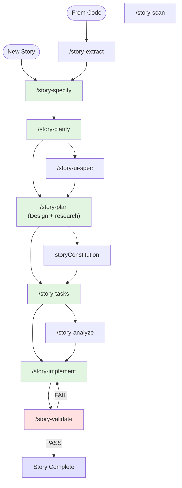

# 🥓 Speck - Speck

Welcome to **Speck**, a comprehensive spec-driven development methodology with project, epic, and story levels! This guide covers everything, but ideally, you'll never need to read it - just run `/speck` and let it guide you.

## 🎯 Quick Start (TL;DR)

Just type `/speck` followed by what you want to do:

```
/speck Build a social networking app
/speck Add user authentication 
/speck Fix the login button
/speck Import my existing codebase at ~/projects/myapp
/speck Continue working on my project
```

The system will:
1. Detect the appropriate level (project/epic/story)
2. Find or create the right context
3. Guide you through the process
4. Suggest next steps

That's it! The `/speck` command handles everything intelligently.

---

## 📖 Table of Contents

1. [System Overview](#system-overview)
2. [Getting Started Scenarios](#getting-started-scenarios)
3. [Command Reference](#command-reference)
4. [Workflow Examples](#workflow-examples)
5. [Best Practices](#best-practices)
6. [Troubleshooting](#troubleshooting)

---

## 🏗️ System Overview

### Three-Level Hierarchy

```
Project Level (Strategic)
├── Epic Level (Tactical)
└── Story Level (Implementation)
```

- **Project**: Overall product vision, goals, and strategy
- **Epic**: Feature sets that deliver specific value
- **Story**: Individual implementable tasks

### Project-Level Command Flow

**Unified Flow** (Same sequence for both greenfield and brownfield):

```mermaid
graph TD
    Start([New Project - Greenfield]) --> ideaCheck{Clear<br/>Idea?}
    ideaCheck --> |Yes| specify
    ideaCheck --> |No| brainstorm
    brainstorm["/project-brainstorm<br/>(Crystallize ideas)"]
    brainstorm --> specify
    
    ImportStart([Import Existing - Brownfield]) --> importCmd
    
    %% BROWNFIELD PRE-SPECIFY EXTRACTION
    importCmd["/project-import<br/>(Extract non-code aspects)"]
    importCmd --> scan
    scan["/project-scan<br/>(Extract code aspects)"]
    scan --> specify
    
    %% UNIFIED FLOW (Both greenfield and brownfield follow this)
    specify["/project-specify<br/>(Define vision)"]
    specify --> clarify
    clarify["/project-clarify<br/>(Resolve ambiguities)"]
    
    clarify --> uxCheck{UX-Heavy<br/>Product?}
    
    uxCheck --> |Yes| ux
    uxCheck --> |No| context
    ux["/project-ux<br/>(Define/extract UX principles + research)"]
    
    ux --> context
    context["/project-context<br/>(Define/extract constraints + research)"]
    context --> constitutionCheck{Complex/<br/>Regulated?}
    
    constitutionCheck --> |Yes| constitution
    constitutionCheck --> |No| architecture
    constitution["/project-constitution<br/>(Define principles)"]
    
    constitution --> architecture
    architecture["/project-architecture<br/>(Design/document system + research)"]
    
    architecture --> designCheck{Design System<br/>Needed?}
    
    designCheck --> |Yes| design
    designCheck --> |No| plan
    design["/project-design-system<br/>(Create/extract design tokens + research)"]
    
    design --> plan
    plan["/project-plan<br/>(Create PRD & epics + research)"]
    
    plan --> roadmapCheck{Roadmap<br/>Needed?}
    
    roadmapCheck --> |Yes| roadmap
    roadmapCheck --> |No| validateGate
    roadmap["/project-roadmap<br/>(Plan timeline)"]
    
    roadmap --> validateGate
    
    %% VALIDATION
    validateGate{Validation}
    validateGate --> analyze
    analyze["/project-analyze"]
    analyze --> validCmd
    validCmd["/project-validate"]
    validCmd --> |GO| epics["Start Epic Development"]
    validCmd --> |NO-GO| specify
    
    style brainstorm fill:#f5e1f5
    style specify fill:#e1f5e1
    style clarify fill:#e1f5e1
    style ux fill:#e1f5e1
    style context fill:#e1f5e1
    style importCmd fill:#fff4e1
    style scan fill:#fff4e1
    style constitution fill:#e1f5e1
    style architecture fill:#ffe1e1
    style design fill:#ffe1e1
    style plan fill:#fff4e1
    style validateGate fill:#ffe1e1
    style epics fill:#e1e1ff
```



**Key Points**:
- Brownfield projects run `/project-import` and `/project-scan` first to extract existing project data
- After extraction (or for greenfield from the start), both follow the same command sequence
- All commands are context-aware and adapt based on import/scan artifacts
- Architecture and design-system come BEFORE planning (design decisions inform planning)
- Commands detect brownfield mode by checking for `project-import.md` or `project-landscape-overview.md`

### Epic-Level Command Flow


### Story-Level Command Flow



### Intelligent Routing

The `/speck` command automatically:
- Detects the scope of your request
- Finds existing context or creates new
- Routes to the appropriate workflow
- Guides you step-by-step

### Greenfield vs Brownfield Philosophy

**Greenfield = Deductive (Top-Down)**:
```
Vision → Constraints → Design → Implementation
```
- You're CREATING new artifacts from scratch
- Commands ask questions to DEFINE what should be
- Interactive Q&A builds context from user input
- Starts directly with `/project-specify`

**Brownfield = Inductive (Bottom-Up)**:
```
Code → Extract → Document → Enhance
```
- You're DISCOVERING what already exists
- Commands EXTRACT from code, then follow same flow
- Code is the source of truth for pre-filling
- Starts with `/project-import` + `/project-scan`, then follows same flow

**Unified Flow**:
Both greenfield and brownfield follow the **same command sequence** after initial setup:
```
specify → clarify → [research] → [ux] → context → [constitution] → architecture → [design-system] → plan → [roadmap] → analyze → validate
```

**Key Differences**:
- **Greenfield**: Commands ask questions, user provides answers, artifacts created from scratch
- **Brownfield**: Import/scan extract data, commands pre-fill answers, same guidance process validates and completes
- **Context-Aware**: All commands detect brownfield mode and adapt their behavior accordingly

**Key Principle**: Brownfield uses import/scan as an extraction step that produces artifacts consumed by the same unified flow, ensuring consistent methodology regardless of starting point.

### Project Command Categories

1. **Core Flow** (Green in diagram): Essential commands that create the main artifacts
2. **Discovery & Research** (Optional): For complex projects needing upfront research
3. **Enhancement** (Optional): Specialized planning for UX, design, architecture
4. **Validation** (Red in diagram): Quality gates before proceeding to implementation
5. **Retrospective** (Blue in diagram): Learning capture and continuous improvement

### Directory Structure

```
specs/
└── projects/
    └── 001-project-name/
        ├── project.md              # TRUTH: Project specification
        ├── project-import.md       # [Brownfield] Non-code aspects extraction
        ├── project-landscape-overview.md  # [Brownfield] Code aspects extraction
        ├── context.md              # TRUTH: Technical context
        ├── constitution.md         # TRUTH: Optional technical principles
        ├── architecture.md         # TRUTH: System architecture
        ├── PRD.md                  # TRUTH: Product requirements
        ├── epics.md                # TRUTH: Epic index (generated/updated by project-plan)
        ├── ux-strategy.md          # TRUTH: UX principles
        ├── design-system.md        # TRUTH: Design tokens & components
        ├── project-retro.md        # LEARNING: Project retrospective (optional)
        ├── project-roadmap.md      # TRUTH: Execution roadmap (optional)
        ├── project-analysis-report.md # VERIFICATION: Read-only analysis output (optional)
        ├── project-validation-report.md # VERIFICATION: Project validation (optional)
        ├── project-validation-summary.md # VERIFICATION: Project validation summary (optional)
        ├── project-punch-list.md   # EXECUTION: Remaining items (optional)
        ├── project-*-research-prompt-*.md # RESEARCH: Prompts (optional)
        ├── project-*-research-report-*.md # RESEARCH: Reports (optional)
        └── epics/
            └── 001-epic-name/
                ├── epic.md                 # PROPOSAL: Epic specification
                ├── context.md              # Epic-specific context (optional)
                ├── constitution.md         # Epic principles (optional)
                ├── epic-outline.md         # PROPOSAL: Technical outline (optional)
                ├── epic-analysis-report.md # VERIFICATION: Read-only analysis output (optional)
                ├── epic-validation-report.md # VERIFICATION: Epic validation (optional)
                ├── epic-punch-list.md      # EXECUTION: Remaining items (optional)
                ├── epic-codebase-scan*.md  # [Brownfield] Epic code analysis (optional)
                ├── epic-architecture.md    # PROPOSAL: Epic technical design
                ├── epic-tech-spec.md       # PROPOSAL: Implementation details
                ├── epic-breakdown.md       # EXECUTION: Story mapping + ordering
                ├── user-journey.md         # UX journey map (optional)
                ├── wireframes.md           # Visual designs (optional)
                ├── epic-retro.md           # LEARNING: Epic retrospective (optional)
                ├── epic-*-research-prompt-*.md # RESEARCH: Prompts (optional)
                ├── epic-*-research-report-*.md # RESEARCH: Reports (optional)
                └── stories/
                    └── 001-story-name/
                        ├── spec.md                 # PROPOSAL: Story requirements
                        ├── plan.md                 # PROPOSAL: Technical design
                        ├── tasks.md                # EXECUTION: Implementation checklist
                        ├── data-model.md           # PROPOSAL: Entities + schemas (optional)
                        ├── contracts/              # PROPOSAL: API/event contracts (optional)
                        ├── quickstart.md           # VERIFICATION: Manual verification path (optional)
                        ├── ui-spec.md              # PROPOSAL: UI spec (optional)
                        ├── validation-report.md    # VERIFICATION: What actually changed (optional)
                        ├── story-retro.md          # LEARNING: Story retrospective (optional)
                        ├── outline.md               # PROPOSAL: Research/decision outline (optional)
                        ├── codebase-scan-*.md       # [Brownfield] Story code analysis (optional)
                        ├── story-*-research-prompt-*.md # RESEARCH: Prompts (optional)
                        └── story-*-research-report-*.md # RESEARCH: Reports (optional)
```

**Truth vs Proposal Model**:
- **Project-level docs** (`project.md`, `PRD.md`, `architecture.md`, etc.) = **Current production state**
- **Epic/Story specs** (`epic.md`, `spec.md`) = **Proposed changes** (until validated)
- **Import/Scan artifacts** = **Brownfield extraction data** (consumed by all commands)
- **After validation** → Update project-level docs to reflect new reality

---

## 🧠 Continuous Learning System

Speck includes a built-in learning capture and retrospective system that makes the methodology self-improving.

### How Learning is Captured

**1. Cursor Hook (Automatic)**
- Logs all file edits to `.learning.log` files
- Tracks change patterns and iteration
- Processed by retrospectives, not committed to git

**2. Git Commit Tags (Manual)**
- Add learning tags to commit messages:
  - `PATTERN:` Reusable code patterns
  - `GOTCHA:` Surprises and pitfalls
  - `PERF:` Performance insights
  - `ARCH:` Architecture decisions
  - `RULE:` Cursor rule updates needed
  - `DEBT:` Technical debt created
- See AGENTS.md "Learning Capture System" section for tag format

**3. Validation Reports (Automatic)**
- Captures spec vs reality gaps
- Performance vs targets
- Pattern usage analysis

### Retrospective Commands

**Story Level**: `/story-retrospective`
- Quick (5-10 min) after story completion
- Captures fresh learnings
- Feeds epic retrospective

**Epic Level**: `/epic-retrospective`
- Deep dive (30-60 min) after epic completion
- Mines commits, logs, validation reports
- Extracts patterns, documents gotchas
- Updates Cursor rules
- Prepares learnings for next epic

**Project Level**: `/project-retrospective`
- Strategic review (2-4 hours) after project launch
- Aggregates all epic learnings
- Evaluates methodology effectiveness
- Improves Speck process itself
- Guides next project

### The Learning Loop

```
Implementation
    ↓ Cursor hook logs changes
    ↓ Commit tags capture decisions
    ↓ Validation reports show gaps
Retrospective
    ↓ Mines all sources
    ↓ Extracts patterns
    ↓ Updates rules
    ↓ Improves process
Next Epic/Project
    ↓ Applies learnings
    ↓ Avoids past mistakes
    ↓ Reuses proven patterns
[Repeat - Continuous Improvement]
```

### Benefits

- **Pattern Library**: Build reusable knowledge automatically
- **Gotcha Prevention**: Document and avoid repeated mistakes
- **Rule Evolution**: Cursor rules stay current with discoveries
- **Velocity Improvement**: Learn and adjust estimations
- **Process Refinement**: Speck itself gets better with each project

---

## 🔬 Just-In-Time Research Pattern

Research happens during command execution, not as a separate phase. Commands use the pattern defined in `.speck/patterns/just-in-time-research-pattern.md`.

### How Research Works

**During Command Execution:**
1. **Command identifies knowledge gap** - During execution, commands detect what information is missing
2. **Web search first** - Uses `web_search` tool for factual/standard information (90% of cases)
   - Standards and specifications (WCAG, RFC, ISO)
   - Framework documentation and best practices
   - Industry standards, performance benchmarks
   - Regulatory requirements
3. **Deep research if needed** - If web search insufficient, generates research prompt
   - Saves as `[command-name]-research-prompt-[topic].md`
   - User runs in Perplexity/Claude/Gemini/Grok
   - User saves results as `[command-name]-research-report-[topic].md`
   - Command incorporates findings
4. **Research trail documented** - All findings embedded in generated artifacts

### Research Embedded in Artifacts

Research is documented directly in the artifacts that use it, not in separate files:

**Project-level artifacts** include "Research Informing This Document" sections:
- `architecture.md` - Technology evaluation, architecture patterns research
- `PRD.md` - Market sizing, competitive analysis, business model research
- `design-system.md` - Design token standards, component pattern research
- `ux-strategy.md` - User research, UX patterns, accessibility standards

**Epic-level artifacts** include research trails:
- `epic-architecture.md` - Integration patterns, performance benchmarks
- `epic-tech-spec.md` - Technical feasibility, security patterns

**Story-level artifacts** include research trails:
- `plan.md` - API usage, implementation patterns, edge cases

### Research Flow Example

**Project Architecture Command:**
```
/project-architecture executes
    ↓ Step 1: Identify knowledge gap (e.g., "Best database for real-time features?")
    ↓ Step 2: Web search for quick answer
    ↓ Step 3: If insufficient, generate research prompt
    ↓ Step 4: User provides research report (if needed)
    ↓ Step 5: Document research trail in architecture.md
    
architecture.md includes:
## Research Informing This Architecture

### Web Search Findings
- **Database Selection**: PostgreSQL with LISTEN/NOTIFY for real-time
  - Source: PostgreSQL docs, Searched: 2024-12-20
  - Applied to: Real-time notification architecture

### Deep Research (if used)
- **Scalability Analysis**: Load testing shows <100ms latency at 10k concurrent
  - Report: project-architecture-research-report-realtime.md
  - Applied to: Infrastructure sizing decisions
```

### Benefits of JIT Research

✅ **No wasted effort** - Research only what's actually needed
✅ **Contextual** - Research happens exactly when decisions are made
✅ **Traceable** - Clear path from research → decision in same document
✅ **Efficient** - Web search covers 90% of needs, deep research for complex cases
✅ **Self-documenting** - Research trail always visible in artifacts

**See `.speck/patterns/just-in-time-research-pattern.md` for complete pattern details.**

## 🎯 Agent Skills

Skills are **domain-specific expertise packages** that AI agents load automatically when relevant to the current task.

### Skills vs. Other Speck Components

| Component | Trigger | Purpose |
|-----------|---------|---------|
| **Commands** | User-triggered (`/speck`) | Workflow orchestration |
| **Rules** | Always-applied or file-pattern | Conventions, standards |
| **Recipes** | Detected by `/speck` router | Project quickstart templates |
| **Skills** | Agent-decided (automatic) | Deep implementation patterns |

### Available Skills

**External Services** (`.claude/skills/external-services/`):
- `stripe/` - Payments, subscriptions, webhooks
- `supabase/` - Database, auth, real-time, RLS
- `clerk/` - Authentication for Next.js/React
- `ai-apis/` - OpenAI & Anthropic patterns
- `sentry/` - Error tracking, performance monitoring
- `resend/` - Transactional email with React Email
- `firebase/` - Firestore, FCM, custom claims
- `posthog/` - Product analytics, feature flags
- `revenuecat/` - In-app purchases, subscriptions

**Technologies** (`.claude/skills/technologies/`):
- `pwa/` - Progressive Web App patterns
- `react-query/` - Server state with TanStack Query
- `websockets/` - Real-time communication
- `docker/` - Containerization patterns
- `github-actions/` - CI/CD pipelines

**Domains** (`.claude/skills/domains/`):
- `saas-billing/` - Subscription state machines, dunning
- `multi-tenancy/` - Tenant isolation, RBAC
- `oauth-implementation/` - OAuth 2.0, PKCE flows
- `gdpr-compliance/` - Consent, data rights

**Architectures** (`.claude/skills/architectures/`):
- `serverless/` - FaaS patterns, cold starts
- `offline-first/` - Sync, conflict resolution

### Relationship to Recipes

**Recipes** define WHAT technologies to use (stack choices).
**Skills** provide HOW to use them effectively (patterns & gotchas).

When a recipe recommends Stripe for payments, the Stripe skill provides:
- Webhook handling best practices
- Common gotchas (idempotency, signature verification)
- Code patterns for checkout, subscriptions

**See `.claude/skills/README.md` for complete details.**

---

## 🚀 Getting Started Scenarios

### Scenario 1: Starting a Brand New Project

```
You: /speck Build a task management platform for remote teams

Speck: I'll help you create a new project! Let me analyze the scope...
     This looks like a project-level initiative. I'll guide you through 
     creating the project specification.
     
     [Creates project structure, asks clarifying questions, generates spec]
     
     Next steps:
     - Define UX strategy with /project-ux (optional)
     - Define constraints with /project-context
     - Design/document architecture with /project-architecture
     - Create PRD and identify epics with /project-plan
```

### Scenario 2: Adding a Feature to Existing Project

```
You: /speck Add real-time notifications to the task manager

Speck: I need to understand the context. Which project is this for?
     
     Available projects:
     1. 001-task-manager - Task Management Platform
     2. 002-chat-app - Team Chat Application
     
     [You select 1]
     
     This looks like an epic-level feature. I'll help you create 
     the notification system epic...
```

### Scenario 3: Implementing a Specific Task

```
You: /speck project:001-task-manager epic:notifications Create notification bell icon

Speck: Got it! This is a story-level task within the notifications epic.
     I'll help you create the story specification...
     
     [Creates story, identifies UI requirements, suggests next steps]
```

### Scenario 4: Importing Existing Codebase

```
You: /speck Import my Rails app at ~/projects/myapp

Speck: I'll create an Speck structure for your existing codebase.
     
     Creating structure...
     - Project ID: 001-myapp
     - Type: Web application
     - Language: Ruby
     
     ✅ Import complete! Created minimal project.md
     
     ⚠️ IMPORTANT: This was a lightweight import (10 min)
     
     Next Steps (REQUIRED):
     1. Run /project-scan for comprehensive analysis
        → Deep architecture analysis
        → Epic discovery
        → Quality metrics
        
     The scan will analyze your Rails app deeply (30-60 min)
     and guide the rest of the brownfield setup.
```

**After scan completes:**
```
You: /project-scan

Speck: Scanning your codebase deeply...
     
     Analysis complete! (45 minutes)
     - Architecture: Rails MVC monolith
     - Found: 5 epic candidates
     - Quality: Good (Test coverage: 82%)
     
     Epic Candidates:
     - Authentication & Authorization (High confidence)
     - User Management (High confidence)
     - Admin Panel (Medium confidence)
     - API Layer (High confidence)
     - Billing System (High confidence)
     
     Full report: specs/projects/001-myapp/codebase-scan.md
     
     Next Steps:
     1. Review scan findings
     2. Run /project-context to extract constraints
     3. Run /project-architecture to document design
     4. Run /project-plan to create PRD from findings
```

### Scenario 5: Continuing Existing Work

```
You: /speck Continue with the authentication epic

Speck: I found the authentication epic in project 001-my-project.
     
     Current status:
     - Stories completed: 3/8
     - Last activity: Login form implementation
     - Next story: Password reset flow
     
     Would you like to:
     1. Continue with password reset story
     2. Review completed stories
     3. Update epic status
```

---

## 📋 Command Reference

### Universal Router
- `/speck [description]` - Intelligent entry point

### Project Level Commands

#### Phase 0: Ideation (Optional - For Vague Ideas)
- `/project-brainstorm` - Transform loose ideas into structured project concepts

#### Phase 1: Discovery (Define WHAT & WHY)
- `/project-specify` - Create project vision, goals, and scope from natural language description
- `/project-clarify` - Ask strategic questions to resolve ambiguities in project spec
- `/project-import` - **Lightweight**: Create Speck structure for existing code (~10 min)
- `/project-scan` - **Comprehensive**: Deep codebase analysis after import (~30-60 min)

#### Phase 2: Foundation (Define Constraints & Principles)
- `/project-ux` - Define user experience strategy and design principles
- `/project-context` - Document constraints and requirements that guide decisions
- `/project-constitution` - Establish project principles and team agreements

#### Phase 3: Technical Design (Design HOW to Build)
- `/project-architecture` - Design/document system architecture within given constraints (input to planning)
- `/project-design-system` - Create/extract design tokens, components, and patterns (optional, before planning for UI-heavy products)

#### Phase 4: Planning (Create PRD & Epic Breakdown)
- `/project-plan` - Transform foundation + design inputs into PRD and epic breakdown
- `/project-roadmap` - Create epic execution timeline and resource allocation plan (optional)

#### Phase 5: Validation
- `/project-analyze` - Deep analysis of completeness and quality
- `/project-validate` - Comprehensive validation with go/no-go gate

#### Phase 6: Retrospective & Learning
- `/project-retrospective` - Capture strategic learnings and evolve methodology

### Epic Level Commands

#### Core Flow (Required Path)
- `/epic-specify` - Create epic specification or enhance placeholder from project-plan
- `/epic-clarify` - Ask targeted questions to resolve epic ambiguities
- `/epic-architecture` - Design technical architecture for the epic
- `/epic-plan` - Transform epic spec into technical blueprint
- `/epic-breakdown` - Create story mapping with dependencies and parallelization

#### Discovery & Research (Optional Pre-Planning)
- `/epic-discover` - Extract epic candidates from codebase
- `/epic-scan` - Analyze existing code patterns relevant to epic
- `/epic-outline` - Map technical decisions and research needs (uses JIT research pattern)

#### Design & UX (Optional Enhancements)
- `/epic-journey` - Map detailed user workflows through epic
- `/epic-wireframes` - Design key interfaces and interactions

#### Governance (Optional)
- `/epic-constitution` - Establish epic-specific principles

#### Validation & Analysis
- `/epic-analyze` - Deep analysis of completeness and quality
- `/epic-validate` - Comprehensive validation with go/no-go
- `/epic-retrospective` - Capture epic learnings and prepare for next epic

### Story Level Commands

#### Core Flow (Required Path)
- `/story-specify` - Create story with user narrative and acceptance criteria
- `/story-clarify` - Ask targeted questions to resolve ambiguities
- `/story-plan` - Transform story into technical design with data model
- `/story-tasks` - Generate numbered, executable implementation tasks
- `/story-implement` - Execute tasks using AI implementation agent
- `/story-validate` - Comprehensive validation against requirements
- `/story-retrospective` - Quick learning capture before next story

#### Discovery & Research (Optional Pre-Planning)
- `/story-extract` - Extract story specifications from existing code
- `/story-scan` - Analyze existing code for reusable patterns
- `/story-outline` - Map technical decisions and research needs (uses JIT research pattern)

#### Design & UX (Optional)
- `/story-ui-spec` - Create detailed interface specifications

#### Analysis
- `/story-analyze` - Deep quality analysis before implementation

---

## 🎯 Workflow Examples

### Example 1: Greenfield Project (From Scratch)

```
Day 1: Project Discovery & Foundation
/speck Create a modern CRM system for small businesses
→ Creates project structure
→ Guides through vision, goals, users

/project-clarify
→ Resolves any ambiguities
→ Fills gaps in specification

/project-ux
→ Define design principles
→ Set experience goals

/project-context
→ Set technical constraints and standards

/project-constitution (for regulated projects)
→ Define project-specific principles

Day 2: Design & Planning
/project-architecture
→ Design/document system within constraints
→ Define component structure and boundaries

/project-design-system (if UI-heavy)
→ Create design tokens and component patterns (optional)

/project-plan
→ Generate PRD incorporating architecture decisions (+ design system if present)
→ Identify epics

/project-roadmap (optional)
→ Plan epic execution timeline

Day 3: Validation & Epic Start
/speck Start working on customer management epic
→ Creates epic structure
→ Defines scope

/epic-journey
→ Map user workflows

/epic-wireframes
→ Design interfaces

/epic-architecture
→ Epic technical design

/epic-plan
→ Technical specification

Day 3: Story Implementation
/speck Create the add customer form
→ Story specification
→ UI requirements

/story-ui-spec
→ Detailed design specs

/story-implement
→ Build it!
```

### Example 2: Brownfield Project (Existing Code)

**Brownfield = Inductive (Bottom-Up)**: Extract → Follow same flow with pre-filled data

```
Step 1: Import (Extract Non-Code - 10 min)
/speck Import my Django project at ~/projects/myapp
→ Creates Speck structure
→ Creates project-import.md with non-code findings
→ Guides to scan

Step 2: Scan (Extract Code Aspects - 10-15 min)
/project-scan
→ Quick landscape survey
→ Identifies potential epic areas
→ Tech stack inventory
→ Creates project-landscape-overview.md
→ LOW CONFIDENCE - directional only

Step 3: Specify (Pre-filled from import/scan)
/project-specify
→ Detects brownfield mode (project-import.md + project-landscape-overview.md exist)
→ Pre-fills project.md with extracted data
→ Marks sections with [FROM IMPORT] or [INFERRED FROM CODE]
→ Guides through validation and completion
→ Creates project.md (same artifact as greenfield!)

Step 4: Clarify (Focused on non-discoverable aspects)
/project-clarify
→ Skips questions about existing features (already in scan)
→ Focuses on strategy, constraints, future goals
→ Updates project.md

Step 5: Context (Extract + Define)
/project-context
→ Pre-fills from scan findings (tech stack, deployment)
→ Asks only for non-code-discoverable context (team, budget)
→ Creates context.md

Step 6: Architecture (Document existing)
/project-architecture
→ Extracts architecture from project-landscape-overview.md
→ Documents existing patterns and structure
→ Proposes improvements if needed
→ Creates architecture.md

Step 7: Design System (Extract existing - optional)
/project-design-system (if UI codebase)
→ Extracts design tokens from UI code
→ Consolidates into recommended system
→ Identifies inconsistencies
→ Creates design-system.md

Step 8: Plan (Organize into PRD)
/project-plan
→ Uses project-landscape-overview.md epic areas as starting point
→ Incorporates architecture decisions
→ Organizes into epics
→ Creates PRD.md + epics.md + epics/

Step 9: Validate & Start Enhancing
/project-validate
→ Review extracted and generated documentation
→ Validate epic boundaries

/speck Add two-factor authentication
→ Create new story using same unified flow
→ Extends existing system using documented patterns
```

**Key Insights**:
- ✅ **Same command sequence** as greenfield after import/scan
- ✅ Commands **adapt automatically** based on import/scan artifacts
- ✅ **Clarify still runs** but focuses on non-discoverable aspects
- ✅ **Architecture comes before plan** (design decisions inform planning)
- ✅ All commands are **context-aware** and detect brownfield mode

### Example 3: Continuous Development

```
Monday: Check Status
/speck Show project status
→ Lists epics and progress
→ Identifies blockers

/speck Continue with highest priority
→ Picks up where you left off

Tuesday: Add Feature
/speck Users need to export their data
→ Determines if story or epic
→ Creates appropriate spec

Wednesday: Fix Issue
/speck The login button is misaligned on mobile
→ Creates fix story
→ Links to existing epic
```

---

## 💡 Best Practices

### 1. Let `/speck` Guide You
- Don't memorize commands
- Just describe what you want
- Follow the suggestions

### 2. Work Top-Down
- Start with project vision
- Break into epics
- Detail into stories

### 3. Follow the Natural Flow
- Discovery: specify → clarify → [research]
- Foundation: ux → context → [constitution]
- Design: architecture → [design-system]
- Planning: plan → [roadmap]
- Validation: analyze → validate

### 4. Architecture When Appropriate
- For Level 3-4 projects: Run full flow including architecture
- For complex epics: Use `/epic-architecture`
- For simple projects: Skip optional commands

### 5. Maintain Context
- Keep specifications updated
- Document decisions
- Track implementation status

### 6. Use Validation
- Fix issues early
- Maintain quality

### 7. Iterate and Refine
- Specs aren't set in stone
- Update as you learn
- Keep aligned with reality

---

## 🔧 Troubleshooting

### "I don't know which level to use"
Just use `/speck` - it will figure it out for you!

### "My project doesn't fit the structure"
The structure is flexible. Epics can be small or large. Stories can be technical or user-facing.

### "I have existing documentation"
Use `/project-import` to analyze and integrate existing docs.

### "Multiple projects are confusing" 
Each project is independent. Use `/speck project:name` to be explicit.

### "I want to skip certain steps"
You can jump to any command directly, but the flow is designed to catch issues early.

---

## 🎓 Advanced Usage

### Context Inheritance
```
Project Context (database, framework)
    ↓
Epic Context (adds specific libraries)
    ↓
Story Context (inherits all above)
```

### Constitution Hierarchy
```
Project Constitution (core principles)
    ↓
Epic Constitution (domain rules)
    ↓  
Story Implementation (follows all)
```

### Parallel Development
Multiple team members can work on:
- Different epics (no conflicts)
- Different stories in same epic
- Share design system and context

---

## 🚦 Quick Decision Guide

**"I want to..."**

Build something new → `/speck [description]`
Import existing code → `/speck import [path]`
Continue working → `/speck continue`
Add a feature → `/speck [feature description]`
Fix something → `/speck fix [issue]`
Check status → `/speck status`

---

## 🔧 Recommended Setup

Configure MCP servers for best experience:

```bash
# (Optional) Add team-shared MCP additions (no secrets):
#   edit .cursor/mcp.project.json.example
#
# Generate your local MCP config (git-ignored) and then add API keys:
bash .speck/scripts/bash/merge-mcp-config.sh
# Restart Cursor after changes
```

**Recommended servers** (see `.cursor/MCP-SETUP.md` for details):
- **Perplexity** - Research and web search
- **GitHub** - PRs, issues, code search
- **Context7** - Up-to-date library docs

> 💡 Speck works without MCP servers via fallbacks, but they're recommended.

---

## 🎉 Getting Started Right Now

1. **For New Projects**: 
   ```
   /speck [Describe your project idea]
   ```

2. **For Existing Code**:
   ```
   /speck import [path to your code]
   ```

3. **For Current Speck Project**:
   ```
   /speck continue
   ```

4. **To Continue Work**:
   ```
   /speck continue
   ```

The system will handle everything else!

---

## 📝 Notes

- The `.speck/` directory contains all templates, patterns, recipes, and scripts
- Speck can be used as a GitHub template repo and kept synced across product repos (see `.speck/TEMPLATE-SYNC.md`)
- Speck can also export validated retrospective learnings back to the template repo (see `.speck/TEMPLATE-FEEDBACK.md`)
- Context and constitutions cascade down the hierarchy
- Everything is designed to be discoverable via `/speck`
- MCP servers are recommended but optional (see `.cursor/MCP-SETUP.md`)

Remember: The goal is to guide you through building great software with clear specifications, not to make you memorize commands. Just tell `/speck` what you want to accomplish!

---

**Version**: 2.0  
**Updated**: [Current Date]  
**Methodology**: Speck (Multi-Level)
