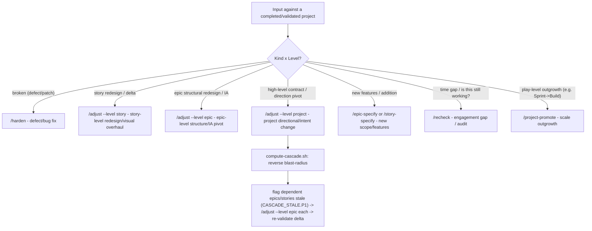

## The Speck Command Phases

> Read each phase's `SKILL.md` for the full procedure. AGENTS.md only lists the **what** and **order**. The skill files contain the **how**.

### Sprint flow
```
/project-specify  →  ship it  →  /project-promote (if it gets traction)
```

### Build flow (1-3 epics)
```
/project-specify → /project-clarify → /project-product-contract → /project-readme → /project-evidence-contract
  → /project-context → [/project-architecture if cross-system]
  → /project-plan (creates PRD + epics + E000 infrastructure epic)
  → [/analyze --level project — recommended at 1-3 epics; REQUIRED at 4+ (see Build flow (4+ epics))]
  → per epic: /epic-specify → /epic-clarify → [/epic-architecture] → [/epic-experience-chain if UI]
              → /epic-plan → /epic-breakdown → /analyze --level epic
  → per story: /story-specify → /story-clarify → [/speck-scan --level story] → /story-plan
              → [/story-ui-spec if UI] → /story-tasks → /story-implement
              → /audit → /story-validate → /larp → /story-retrospective
  → /audit (epic-level) → /epic-validate → /larp (full JTBD walkthrough) → /epic-retrospective
  → /project-validate → /project-retrospective
```

### Build flow (4+ epics) — gate triggers required architecture + ux-strategy + project analysis
Same as Build but `/project-architecture` and `/project-ux` are **required before** `/project-plan`, and `/analyze --level project` is **required after** `/project-plan` and before the first `/epic-specify` — 3 decorrelated lenses minimum (promise-coverage · cross-artifact drift · completeness critic). `/epic-specify` runs `check-epic-prereqs.sh` and refuses to start on `UNANALYZED_CORPUS.P1`.

### Platform flow
Full flow: includes `/project-domain` → `/project-ux` → `/project-context` → `/project-constitution` → `/project-architecture` → `/project-design-system` → `/project-product-contract` → `/project-readme` → `/project-evidence-contract` → `/project-plan` → `/analyze --level project` (**required**, all 7 lenses) → `/project-roadmap`. `/project-state` keeps README status current after validation gates.

### Reengagement & Intent Changes
On any new session: read `project-state.md`.
- If missing or stale (>2 weeks since last verified-against-runtime), run `/recheck` before any feature work to detect drift.
- If the session is triggered by an **intent change** or **strategic pivot** to a completed/validated project, run `/adjust --level project` to safely spec the delta and compute the reverse cascade rather than making silent code changes or re-authoring specs from scratch.

### 🔄 Continuous Project Lifecycle & Post-Completion Triage Router

The project lifecycle is continuous: post-`/project-validate` does not mean terminal freeze ("v1 shipped, evolving"). When new input, feedback, or pivot requests are received against a completed/validated project, the conductor MUST route the request using the **Post-Completion Triage Router**:



#### Triage Router Decision Matrix
1. **Defect/Bug Fix in Validated Work**: Run `/harden` to document root-cause and add systemic tests.
2. **Deliberate Story Redesign/Visual Overhaul**: Run `/adjust --level story` to spec the delta, update story `plan.md`, and conserve promises.
3. **Deliberate Epic Structural Pivot / IA Redesign**: Run `/adjust --level epic` to re-spec epic-level deltas and update epic `traceability-matrix.md`.
4. **Project Directional Pivot / Strategic Contract Change**: Run `/adjust --level project` to update `product-contract.md` and force a superseding DEC, run `compute-cascade.sh` to determine the blast-radius of affected downstream epics/stories, and route each to `/adjust --level epic` or `/adjust --level story`.
5. **New Features / Addition**: Run `/epic-specify` or `/story-specify` to draft new specs from scratch.
6. **Time Gap / Audit**: Run `/recheck` to scan for drift, stale dependencies, and schema drift.
7. **Scale/Rigor Outgrowth**: Run `/project-promote` to upgrade play levels (e.g. Sprint to Build, or Build to Platform).

### Concurrent multi-epic execution (Platform / 4+ epics)

When 2+ epics run in parallel (separate sessions or worktrees), shared truth artifacts are contention hotspots. Use this doctrine — do not improvise per-project workarounds.

| Rule | What | How |
|------|------|-----|
| **Worktree isolation** | One epic = one branch + optional worktree off *current* `main` | `git worktree add ../<repo>-eNNN -b epic/eNNN origin/main` (or `main`). Rebase off `main` daily: `git fetch && git rebase origin/main`. Never branch parallel epics from a stale pre-foundation base. |
| **Push-before-spawn** | Worktrees branch from `origin/main`, NOT local `HEAD` | `git push origin main` the full planning corpus (epic specs, tech-spec, wireframes, DECs) **before** spawning any worktree wave, and after every merge. Unpushed local commits are invisible to worktrees → the first wave builds blind to locked specs. Each sub-agent prompt carries a precondition guard: "verify `<spec path>` exists on this branch, else abort." |
| **Worktree disk hygiene & WIP Recovery** | Worktrees are a shared, exhaustible host resource | Each `isolation: worktree` sub-agent runs `pnpm install` + build (~1 GB+). Many parallel worktrees → host `ENOSPC` freezes **every** session on the machine (the harness writes a tmp file per command). **MUST** run `git worktree remove ../<repo>-eNNN` (no `--force` by default so git warns you of any lost WIP) after each merge. Cap concurrent worktrees to the current wave; treat free disk as cross-session shared state. If a background agent is interrupted/killed, recover WIP directly from its worktree on disk (`git add -A && commit`) instead of deleting and restarting. |
| **Conflicted-Merge Commit Guard** | Husky + lint-staged stash index corruption | Committing a manually resolved conflicted merge can cause lint-staged `--keep-index` stashing to corrupt the index, silently dropping auto-merged files (creating a broken single-parent commit). **MUST** commit conflicted merges using `git commit --no-verify`, then verify `git show --stat HEAD` lists all files and the commit has 2 parents. |
| **DEC bands** | Prevent `project-decisions-log.md` number races | Project-level: `DEC-0001`–`DEC-0099`. Epic E###: `DEC-{NN}01`…`DEC-{NN}99` where `{NN}` = epic number (`E002` → `DEC-0201+`). Log via `/speck-decision-log` only. |
| **project-state merge-only** | Single-file full regen clobbers under parallelism | Epic sessions on `epic/*` branches: **read** `project-state.md`, do **not** overwrite. Regenerate on `main` only (merge PR author or post-merge `/project-state`). |
| **Migration ownership + version coordination** | Concurrent schema changes collide on shared tables AND on identical timestamps | **Schema-Freeze Foundation Epic Pattern (Recommended)**: One Wave-0 epic creates *all* shared tables/columns the whole feature set needs. Downstream epics **consume** the frozen schema and author **zero** shared-table migrations, collapsing collisions to zero. Otherwise, each epic owns **new** tables/migrations only; foundation/shared tables are frozen. Filenames: **real wall-clock 14-digit UTC** (`date -u +%Y%m%d%H%M%S`) — never rounded placeholders (parallel epics keep picking the same round number → collisions). Fallback when scripting stamps: per-epic second/minute offset bands (`E002` → `…NN02`, `E003` → `…NN03`). One migration author per wave; post-freeze migrations are solo waves. Validate ordering on a Supabase branch per PR. |
| **Epic waves** | Integrators must not start before upstreams land | `epics.md` declares concurrency waves (see template). Only epics in the **current wave** may run in parallel. Integrator epics (2+ upstream dependencies) start after upstream merges to `main`. |

**Spawn parallel epics**: User says "run E002+E003 in parallel" → `/speck` validates wave safety from `epics.md`, **pushes the planning corpus to `origin/main` first**, creates worktrees/branches per epic, assigns DEC bands, and routes each session to `/epic` with branch context. After each epic merges, `git worktree remove --force` it. Story implementation may still use `@speck-coder` `isolation: worktree` inside an epic session. The conductor keeps a durable **orchestration ledger** (`.speck/templates/project/orchestration-ledger-template.md`) as the one file that survives compaction / spend / rate-limit resets. The full conductor pattern (loop + ledger + verify-skills gate + guards) is in `.speck/patterns/learned/process/parallel-epic-execution.md`.

### Delegated execution: verify skills ran before accepting results

Speck's rigor lives in the **skills** (the adversarial `/audit` probes, honest readiness-state discipline, decision logging). A delegated or background sub-agent can emit template-shaped `spec.md` / `plan.md` / `validation-report.md` with a declared readiness state **without ever invoking those skills** — and it passes every superficial check. Code can be sound while the validation *claims* are untrue (a "verified" test that never existed, `axe 0/0` with no axe JSON, "live" proof from a side-harness). **Never merge on a sub-agent's self-reported verdict.**

**Sub-agent return contract** — every delegated story/epic unit returns:

```
{ readiness_state, pass, p0p1: [...], artifact_paths: [...], skills_invoked: [...], gate_checks: [{ name, pass, evidence }] }
```

`skills_invoked` lists the actual Skill invocations made (e.g. `story-specify`, `speck-audit`, `story-validate`). `gate_checks` lists results for the project's full pre-commit gate (unit tests, eslint, types/tsc, banned-language, build). Self-reported fields are **not** tamper-evident (host-runtime limitation) — the transcript check below is the backstop.

**Verify-skills gate** — before ACCEPTING/merging a delegated result, the conductor MUST:

1. Confirm required reports exist AND pass `.speck/scripts/validation/validate-template.sh --strict`.
2. Verify ≥2 real skill invocations in the sub-agent transcript — stories: `speck-audit` + `story-validate`; epics: `analyze` (with a `level=epic` receipt) + `epic-validate`. Grep transcript/tool log for `"name":"Skill"`. Empty `skills_invoked` or zero Skill calls → REJECT + re-run.
   For a profile declared in `.speck/reference/skill-load-contracts.json`, also run `validate-context-transcript.py` with its exact selectors and require REACH, SELECTIVITY, TIMING, and GATE_USE independently green. A skill call without its required JIT receipt is incomplete execution.
3. Require an independent `audit-report.md` by a SEPARATE auditor (not the implementer/validator). High-risk (P0/P1, sensitive data, auth/billing): N diverse-lens auditors; majority-refute; list lenses in the report.
4. Verify `gate_checks` shows full pre-commit gate ran and passed (lint, typecheck, tests, build, banned-language). Missing/skipped/failed → reject. Green tests alone ≠ green gate.
5. Treat `/audit` as non-skippable before merge in delegated flows.

A unit with passing-looking artifacts and zero skill calls is simulated, not validated — reject it.
