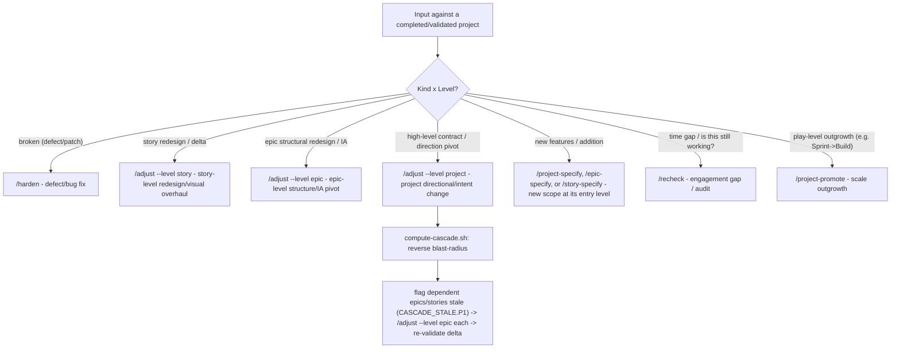

## The Speck Command Phases

> Read each phase's `SKILL.md` for the full procedure. AGENTS.md only lists the **what** and **order**. The skill files contain the **how**.

## Canonical order

The `<!-- SPECK:FLOW:START -->` block in root `AGENTS.md` is the single canonical order and is always loaded. This reference explains conditional gates and execution mechanics; it never carries a second flow copy.

Bracketed slots in AGENTS are evaluated when reached. Skip only when the named condition is false or the selected skill's play-level guard says to skip.

### Build flow (4+ epics) — gate triggers required architecture + ux-strategy + project analysis
Same as Build but `/project-architecture` and `/project-ux` are **required before** `/project-plan`, and `/analyze --level project` is **required after** `/project-plan` and before the first `/epic-specify` — 3 decorrelated lenses minimum (promise-coverage · cross-artifact drift · completeness critic). `/epic-specify` runs `check-epic-prereqs.sh` and refuses to start on `UNANALYZED_CORPUS.P1`.

### Platform gates

Platform runs every non-UI foundation slot in the AGENTS flow; `project-domain` remains conditional on a specialized domain and `project-design-system` on a UI surface. Project analysis is required with all 7 lenses. `project-state` refreshes after truth gates land on main.

### Reengagement & Intent Changes
On any new session: read `project-state.md`.
- If missing or stale (>2 weeks since last verified-against-runtime), run `/recheck` before any feature work to detect drift.
- If the session is triggered by an **intent change** or **strategic pivot** to a completed/validated project, run `/adjust --level project` to safely spec the delta and compute the reverse cascade rather than making silent code changes or re-authoring specs from scratch.

### 🔄 Continuous Project Lifecycle & Post-Completion Triage Router

The project lifecycle is continuous: post-`/project-validate` does not mean terminal freeze ("v1 shipped, evolving"). When new input, feedback, or pivot requests are received against a completed/validated project, the conductor MUST route the request using the **Post-Completion Triage Router**:

#### Triage Router Decision Matrix
1. **Defect/Bug Fix in Validated Work**: Run `/harden` to document root-cause and add systemic tests.
2. **Deliberate Story Redesign/Visual Overhaul**: Run `/adjust --level story` to spec the delta, update story `plan.md`, and conserve promises.
3. **Deliberate Epic Structural Pivot / IA Redesign**: Run `/adjust --level epic` to re-spec epic-level deltas and update epic `traceability-matrix.md`.
4. **Project Directional Pivot / Strategic Contract Change**: Run `/adjust --level project` to update `product-contract.md` and force a superseding DEC, run `compute-cascade.sh` to determine the blast-radius of affected downstream epics/stories, and route each to `/adjust --level epic` or `/adjust --level story`.
5. **New Features / Addition**: Run `/project-specify`, `/epic-specify`, or `/story-specify` at the level where the new scope enters.
6. **Time Gap / Audit**: Run `/recheck` to scan for drift, stale dependencies, and schema drift.
7. **Scale/Rigor Outgrowth**: Run `/project-promote` to upgrade play levels (e.g. Sprint to Build, or Build to Platform).

### Concurrent multi-epic execution (Platform / 4+ epics)

Load `.cursor/skills/parallel-execution/SKILL.md` before dispatch. Its branch-specific references own wave safety, worktree mechanics, and delegated-result verification; this file does not duplicate them.

Keep the orchestration ledger from `.speck/templates/project/orchestration-ledger-template.md` on the integration branch. It is coordination state, not a SHA-stamped truth artifact. Regenerate `project-state.md` only after accepted work merges.
