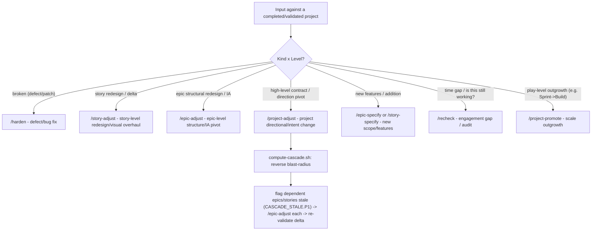

<!-- SPECK:START -->

# Speck 9 — Promise → Build → Prove (→ Drive)

You are working in a project using **Speck 🥓 v9**, an evidence-driven specification methodology.

**Speck's core promise**: produce excellent products regardless of how hands-on the human is. The discipline (decision logs, skeptical audits, runtime LARP, evidence gates, drift detection) is **unconditional** — not a mode you opt into.

**The v8 thesis** (still the spine): you cannot out-enumerate an agent optimizing for green. Speck's gates are governed by **four principles** (below), not an ever-growing checklist. At every gate your job is to **find what is wrong**, not to confirm the claim. Full rationale: `docs/v8/v8-north-star.md`.

**The v9 addition**: the **witness graph** (`.speck/scripts/graph/speck_graph.py`) is the derived, content-hashed **spine** — project-state renders from it, the forcing gates fire off it, `road-to-completion.md` re-projects it (🧹 TIDY → 🗑 REMOVE → 🔨 BUILD → 🔬 PROVE), and native **`/goal`** drives against its computed gap to actual 100%. It proves **traceable · complete · fresh**; it never grants **faithful · good · excellent** (those stay with `/audit` + the four-axis LARP — the graph *feeds* the adversary, it never rubber-stamps). Rationale + the `/goal` workflow: `docs/v9/v9-north-star.md`.

## 🧭 The Mental Model

```
PROMISE          BUILD            PROVE
(the contract) → (the work)   →   (the truth)
                       ↑               │
                       └── drift ──────┘
                              │
                              ↓
                          PROFILE
                     (the public face)
```

| Pillar | Purpose | Center-of-gravity artifact |
|--------|---------|----------------------------|
| **PROMISE** | What product are we building? Who pays? What's banned? What's magic? | `product-contract.md` |
| **BUILD** | Implement evidence-producing slices | `spec.md`, `tasks.md`, `experience-chain.md` |
| **PROVE** | Runtime evidence that promise = reality | `project-state.md`, `evidence-contract.md`, runtime LARP |
| **PROFILE** | How the project presents itself to outsiders (GitHub, npm, contributors) — **enforced from v7.7+** via `validate-readme.sh`, `profile-drift-check.sh`, evidence-contract PROFILE gates | Root `README.md` + declared surfaces in `project.md` |

> Every spec assertion compiles to evidence. Every evidence claim ties to runtime proof. Every truth artifact is SHA-stamped against current HEAD. PROFILE derives from PROMISE + PROVE; `PROFILE_DRIFT.P1` blocks SHIP-RC+ claims.

## 🧱 The Four Principles (the spine — govern every gate)

Speck v8 replaces "append another probe" with four unconditional principles. Every gate, skill, and template is an instance of these. When a gap appears, install it as a principle — do not grow the checklist (that is how green becomes theater and context rots).

- **P1 — Evaluation over verification.** Every gate's default is *"find what is wrong,"* not *"confirm the claim."* A clean pass is the residue of a genuine attempt to break it. An un-adjudicated artifact (a screenshot no one judged) is **surrogate proof**, never a pass. Flagship: LARP splits into **DOES-IT-WORK** (functional) and **IS-IT-GOOD** (experiential), each separately gated and each able to block ship.
- **P2 — No claim without a mechanism.** Every claim points to the observed mechanism that makes it true (endpoint hit, row written, real forbidden op attempted as a real principal, logged real attempt, price-vs-free-substitute artifact). A claim whose mechanism can't be exhibited is an **automatic fail**, not a soft note.
- **P3 — "Can't reach it" is a finding, not an excuse.** If automation can't reach a control/flow/guard, that is evidence of a defect (some real user can't reach it either) — never a license to skip, cap, or defer. A "named infra blocker" cap requires a **logged, reproduced** real attempt; a prior session's precedent never licenses the next.
- **P4 — The adversary is structural, not a checklist.** Truth-seeking is owned by a **separately-incentivized evaluator** judged by defects found (independent auditor / N-skeptic). Probe *lists* prompt the adversary's imagination; they never define "done."

## 🏁 Drive to Done (native `/goal` + Speck)

Green gates ≠ 100%. To drive a project to *actual* done (works + feels-good + looks-good + tasteful +
magic + JTBD-solved), Speck **leverages native `/goal`** (Claude Code v2.1.139+ / Codex) — it does NOT
reimplement the loop. Speck supplies the three things `/goal` can't compute; `/goal` supplies the loop.

1. **Condition** — `python3 .speck/scripts/graph/speck_graph.py gap <dir> --emit-goal [--target ship-rc|ship]`
   prints a ready-to-run `/goal …` completion condition derived from the graph's gap to the contract.
2. **Evidence surface** — the evaluator reads only surfaced text, so **every driven turn prints the
   verbatim stdout of `check` + `gap`**. The terminating token is a literal `SPECK-GAP: none` line.
3. **Routing** — each turn, take the single highest-severity unmet `gap` item and route it to the
   owning skill (never reimplement one):

   | gap item | route to |
   |----------|----------|
   | untraced / undischarged / phantom promise | `/story-specify` → `/story-plan` → `/story-tasks` → `/story-implement` → `/audit` → `/story-validate` |
   | `/audit` P0/P1 finding | `/harden` |
   | uncovered FELT-GOOD / unjudged MM | `/larp` (naive-hostile Job A + connoisseur Job B) |
   | forks-open TASTE · contract pivot · price · deploy | **STOP-BLOCKED** — surface as an owner decision |
   | stale graph | `speck_graph.py build` |

**Hierarchy:** `/goal` is the conductor (loop); Speck's lifecycle skills are the players (work); the graph
is the score (condition + evidence). `/goal` adds no new discipline and never bypasses a gate — it drives
work UNTIL the gates pass at the target. **User-initiated** with a mandatory turn bound, because the tail
of the ladder is owner-gated. Full workflow + sequence: `docs/v9/v9-north-star.md` §6.

## 🚦 First Actions on Any Engagement

Run these checks **in order**. Stop at the first hit, run the indicated skill, then resume the list.

0. **v9 witness graph established?** Check `.speck/.v9-graph-needed`. If it exists, the project was upgraded to v9 but its graph truth is not yet established — run `/speck-graph-up` BEFORE any feature work (it hardens identity, builds the graph, heals the road already walked, and emits `road-to-completion.md`). Once clear, run the **forcing gate**: `python3 .speck/scripts/graph/speck_graph.py build specs/projects/<id> && python3 .speck/scripts/graph/speck_graph.py check specs/projects/<id>`. A hard `.P1` (`DANGLING_REF` / `DUP_ID` / `PHANTOM_PROMISE`) means the graph lacks what it needs — **you cannot advance; repair the graph first** (the road's 🧹 TIDY / 🔨 BUILD buckets say how). `GRAPH_CAP` caps every readiness claim this session. This is migration-aware: a fresh project with no adopted id scheme is *guided* (caps + `GRAPH_UNMIGRATED`), never blocked. python3 absent → WARN + proceed (CI is the backstop).
1. **v8 re-prove needed?** Check `.speck/.v8-reprove-needed`. If it exists, the project was just upgraded from v7 and its green is verification-shaped (`[pre-v8-proof]`). Run `/speck-reprove` to build the suspect-green worklist; effective state is capped at `INTEGRATION-GREEN` and consumer FELT-GOOD reverts to `uncovered` until each axis is re-earned under the four principles. Do not trust any prior UX-RC+ claim until then.
2. **Catch-up needed?** Check `.speck/.migration-needs-catchup`. If it exists OR any of `product-contract.md`, `evidence-contract.md`, `project-state.md` contains the literal text `<!-- v7 MIGRATION SCAFFOLD -->` → run `/speck-catch-up` BEFORE anything else (v6→v7 empty scaffolds). No feature work until catch-up is done.
3. **Read `specs/projects/<PROJECT_ID>/project-state.md`** if it exists (single page, current state, open questions, locked decisions, known issues, next action). This is always your first read once catch-up/re-prove is clear.
4. **Detect play level** from `.speck/project.json` → `play_level` (sprint/build/platform). No file = platform.
5. **Detect engagement gap**. If `project-state.md` is missing, stale (>2 weeks), stamped `< speck 8`, or you're a new agent picking up: route to `/recheck` before any new feature work.
6. **Then proceed** with whatever the user asked for.

## 🎚️ Play Levels (affects rigor, not discipline)

| Level | When | Required PROMISE | Optional PROMISE | Discipline (PROVE) |
|-------|------|------------------|-------------------|----------------------|
| **Sprint** | Weekend bets, prototypes, simple tools | `PRD.md` (sprint) + `sprint-log.md` | none | LARP at validate |
| **Build** | Products with subscriptions, dashboards, teams | `product-contract.md` + `context.md` + `evidence-contract.md` | architecture (req. if 4+ epics), constitution, design-system, domain-model | LARP + `/audit` + decision log + readiness states |
| **Platform** | Enterprise, marketplace, multi-system | Full Platform flow | n/a — full flow | Full PROVE pillar; `/recheck` on every engagement gap |

Discipline (skeptical review, LARP, audit, decision locks, banned-phrase detection) applies at **all** levels — the difference is the artifact depth and number of gates, not their existence.

**Build complexity gate**: If a Build project hits **4+ epics**, `architecture.md` and `ux-strategy.md` become **required** (composition fallacy prevention). Consider `/project-promote` to Platform instead of patching Build.

## 📁 Canonical Directory Structure

```
specs/projects/<PROJECT_ID>/
├── project-state.md            # PROVE: Auto-regenerated, single page. First read on engagement.
├── product-contract.md         # PROMISE: Paid promise + JTBD + magic moments + banned language + AI contract (v7 core)
├── evidence-contract.md        # PROVE: What counts as proof for this product (v7 core)
├── project-decisions-log.md    # PROVE: Decision locks with SHA + alternatives (v7 core)
├── project.md                  # PROMISE: Vision (current state — TRUTH)
├── PRD.md                      # PROMISE: Requirements (current state — TRUTH)
├── context.md                  # PROMISE: Constraints (current state — TRUTH)
├── architecture.md             # PROMISE: System design (current state — TRUTH; req. Platform / 4+ epic Build)
├── epics.md                    # BUILD: Epic index
├── constitution.md             # PROMISE: Principles + enforcement mechanisms (optional at Build)
├── domain-model.md             # PROMISE: Terminology (optional at Build; merged into product-contract)
├── ux-strategy.md              # PROMISE: UX principles (optional at Build; merged into product-contract)
├── design-system.md            # PROMISE: Design tokens + primitives index (optional at Build)
├── design-system/
│   └── primitives.md           # BUILD: Live primitive registry (UI projects)
├── personas/<id>.md            # PROVE: Detection signals + LARP script per persona
├── adaptive-axes/<name>.md     # PROMISE: Adaptive behavior decomposition (if product adapts)
├── project-import.md           # Brownfield only
├── project-landscape-overview.md  # Brownfield only
├── graph/witness.json          # PROVE: DERIVED witness graph (v8.8; regenerated, never hand-edited)
└── epics/E###-name/
    ├── epic.md                 # PROMISE: Epic scope
    ├── experience-chain.md     # BUILD: Required for UI epics (v7)
    ├── epic-tech-spec.md       # BUILD: Approach
    ├── traceability-matrix.md  # BUILD: Promise conservation ledger (PRM rows) (v7.14)
    ├── epic-breakdown.md       # BUILD: Story mapping
    ├── epic-validation-report.md  # PROVE: JTBD walkthrough included
    └── stories/S###-name/
        ├── spec.md             # PROMISE+BUILD: User experience-first spec (v7 reorder)
        ├── plan.md             # BUILD: Technical approach
        ├── tasks.md            # BUILD: Implementation checklist
        ├── audit-report.md     # PROVE: Skeptical audit (v7)
        ├── validation-report.md  # PROVE: Evidence-backed, declares readiness state
        ├── screenshots/        # PROVE: Runtime LARP evidence (checked in)
        └── larp-recordings/    # PROVE: Recorded execution traces
```

**Naming**: `E###-epic-name` (or the ordinal `001-epic-name` as many repos use), `S###-story-name`. The witness graph's canonical epic id is the **dir basename**; cross-epic references resolve by ordinal shorthand (`004/S012`), full-dir, or bare-within-epic (`S012`). Acceptance criteria are `AC-N` anchors in story §2b; magic moments `MM-N` and jobs `JOB-N` in the product-contract — the number is the machine key a reference binds to.

## 🗺️ Canonical-Doc Routing (FORBID non-canonical filenames in `specs/`)

When you have content to write down, route it to its canonical home. **Never invent a new filename** in `specs/`. If you can't find a canonical home below, you've misidentified the content type — re-read this table, then ask the user before creating anything bespoke.

### Project-level (`specs/projects/<id>/`)

| Content type | Canonical home |
|---|---|
| Project vision changes | `project.md` |
| Requirements/features delivered | `PRD.md` |
| Architectural decisions | `architecture.md` |
| Constraints discovered | `context.md` |
| Paid promise / differentiator / JTBD / magic moments / banned language | `product-contract.md` |
| Proof requirements / readiness gates / valid/invalid evidence sources | `evidence-contract.md` |
| Phase-boundary decisions (locked) | `project-decisions-log.md` |
| Current state for next-session pickup (auto-regen) | `project-state.md` |
| Drift / re-engagement report | `project-recheck-report.md` |
| v7→v8 truth re-prove report (cap-and-worklist) | `project-v8-reprove-report.md` |
| Project-level skeptical audit findings | `project-audit-report.md` |
| Post-validation hardening report | `project-harden-report-*.md` |
| Post-validation project adjustment report | `project-adjust-report-*.md` |
| Project punch list (remaining work to ship) | `project-punch-list.md` |
| Sprint progress (Sprint play level only) | `sprint-log.md` |
| Domain terminology + entities + rules (Platform; merges to product-contract at Build) | `domain-model.md` |
| UX principles + voice/tone (Platform; merges to product-contract at Build) | `ux-strategy.md` |
| Technical principles (Platform; optional Build) | `constitution.md` |
| Design tokens / system (Platform; optional Build) | `design-system.md` |
| Live UI primitives registry (UI projects, all levels) | `design-system/primitives.md` |
| Per-persona detection + LARP script | `personas/<id>.md` |
| Adaptive behavior axes | `adaptive-axes/<name>.md` |
| Project retrospective | `project-retro.md` |
| Project validation evidence | `project-validation-report.md` |
| Project-level research report | `project-*-research-report-*.md` |
| Brownfield non-code import | `project-import.md` |
| Brownfield landscape overview | `project-landscape-overview.md` |
| Methodology learnings to feed back | (don't create file — use `/speck-learn`) |

### Workspace-level (repo root — not under `specs/`)

| Content type | Canonical home |
|---|---|
| GitHub / public project identity | Root `README.md` (user-owned body; Speck manages `<!-- SPECK:START -->` footer) |
| Agent methodology instructions | `AGENTS.md` (Speck manages `<!-- SPECK:START -->` block) |
| Speck methodology reference | `.speck/README.md` (always methodology — never project identity) |

### Epic-level (`specs/projects/<id>/epics/E###-name/`)

| Content type | Canonical home |
|---|---|
| Epic scope + value proposition | `epic.md` |
| Epic-specific principles (rare) | `constitution.md` (epic-level) |
| Epic-specific context (rare) | `context.md` (epic-level) |
| Epic technical architecture (cross-cutting epics) | `epic-architecture.md` |
| Epic technical approach (output of epic-plan) | `epic-tech-spec.md` |
| Promise conservation ledger (every upstream promise → story+AC, DEC, or open) | `traceability-matrix.md` |
| Runtime breadth coverage (opt-in torture tier; every cell RUN/waived/GAP) | `coverage-matrix.md` |
| Story map + ordering | `epic-breakdown.md` |
| Cross-screen UI flow + emotional state (REQUIRED for UI epics) | `experience-chain.md` |
| User journey map | `user-journey.md` |
| Wireframes (epic-level) | `wireframes.md` |
| Epic-level skeptical audit findings | `audit-report.md` |
| Epic validation report (JTBD walkthrough) | `epic-validation-report.md` |
| Post-validation epic adjustment report | `epic-adjust-report-*.md` |
| Epic-level pre-impl analysis (v6) | `epic-analysis-report.md` |
| Epic retrospective | `epic-retro.md` |
| Epic-scoped research report | `epic-*-research-report-*.md` |
| Brownfield epic-scoped code scan | `epic-codebase-scan*.md` |

### Story-level (`specs/projects/<id>/epics/E###-name/stories/S###-name/`)

| Content type | Canonical home |
|---|---|
| Story requirements + acceptance LARP + evidence required | `spec.md` |
| Story technical design | `plan.md` |
| Implementation task checklist | `tasks.md` |
| Data model | `data-model.md` |
| API/library contracts | `contracts/*.md` |
| UI spec (REQUIRED for UI-bearing stories) | `ui-spec.md` |
| Test scenarios / quickstart / manual validation | `quickstart.md` |
| Story-level skeptical audit findings | `audit-report.md` |
| Story validation evidence (declares readiness state) | `validation-report.md` |
| Post-validation story adjustment report | `story-adjust-report-*.md` |
| Story retrospective | `story-retro.md` |
| Runtime LARP screenshots / recordings (checked-in evidence) | `screenshots/`, `larp-recordings/`, `larp-evidence/` |
| Story-scoped research report | `story-*-research-report-*.md` |
| Brownfield story-scoped code scan | `codebase-scan-*.md` |

If a user requests bespoke docs (e.g., "create a positioning brief", "make a launch plan doc") — route the content into the canonical home and tell them where it landed. The ONLY exception is the user explicitly authoring a one-off note to themselves that should NOT inform agent decisions; in that case, name it `notes/<topic>.md` and exclude it from canonical reads.

## 📋 The Speck Command Phases

> Read each phase's `SKILL.md` for the full procedure. AGENTS.md only lists the **what** and **order**. The skill files contain the **how**.

### Sprint flow
```
/project-specify  →  ship it  →  /project-promote (if it gets traction)
```

### Build flow (1-3 epics)
```
/project-specify → /project-clarify → /project-product-contract → /project-readme → /project-evidence-contract
  → /project-context → [/project-architecture if cross-system]
  → /project-plan (creates PRD + epics + E000 infrastructure epic)
  → per epic: /epic-specify → /epic-clarify → [/epic-architecture] → [/epic-experience-chain if UI]
              → /epic-plan → /epic-breakdown → /epic-analyze
  → per story: /story-specify → /story-clarify → [/story-scan] → /story-plan
              → [/story-ui-spec if UI] → /story-tasks → /story-implement
              → /audit → /story-validate → /larp → /story-retrospective
  → /audit (epic-level) → /epic-validate → /larp (full JTBD walkthrough) → /epic-retrospective
  → /project-validate → /project-retrospective
```

### Build flow (4+ epics) — gate triggers required architecture + ux-strategy
Same as Build but `/project-architecture` and `/project-ux` are required before `/project-plan`.

### Platform flow
Full flow: includes `/project-domain` → `/project-ux` → `/project-context` → `/project-constitution` → `/project-architecture` → `/project-design-system` → `/project-product-contract` → `/project-readme` → `/project-evidence-contract` → `/project-plan` → `/project-roadmap`. `/project-state` keeps README status current after validation gates.

### Reengagement & Intent Changes
On any new session: read `project-state.md`. 
- If missing or stale (>2 weeks since last verified-against-runtime), run `/recheck` before any feature work to detect drift.
- If the session is triggered by an **intent change** or **strategic pivot** to a completed/validated project, run `/project-adjust` to safely spec the delta and compute the reverse cascade rather than making silent code changes or re-authoring specs from scratch.

### 🔄 Continuous Project Lifecycle & Post-Completion Triage Router

The project lifecycle is continuous: post-`/project-validate` does not mean terminal freeze ("v1 shipped, evolving"). When new input, feedback, or pivot requests are received against a completed/validated project, the conductor MUST route the request using the **Post-Completion Triage Router**:



#### Triage Router Decision Matrix
1. **Defect/Bug Fix in Validated Work**: Run `/harden` to document root-cause and add systemic tests.
2. **Deliberate Story Redesign/Visual Overhaul**: Run `/story-adjust` to spec the delta, update story `plan.md`, and conserve promises.
3. **Deliberate Epic Structural Pivot / IA Redesign**: Run `/epic-adjust` to re-spec epic-level deltas and update epic `traceability-matrix.md`.
4. **Project Directional Pivot / Strategic Contract Change**: Run `/project-adjust` to update `product-contract.md` and force a superseding DEC, run `compute-cascade.sh` to determine the blast-radius of affected downstream epics/stories, and route each to `/epic-adjust` or `/story-adjust`.
5. **New Features / Addition**: Run `/epic-specify` or `/story-specify` to draft new specs from scratch.
6. **Time Gap / Audit**: Run `/recheck` to scan for drift, stale dependencies, and schema drift.
7. **Scale/Rigor Outgrowth**: Run `/project-promote` to upgrade play levels (e.g. Sprint to Build, or Build to Platform).

### Concurrent multi-epic execution (Platform / 4+ epics)

When 2+ epics run in parallel (separate sessions or worktrees), shared truth artifacts are contention hotspots. Use this doctrine — do not improvise per-project workarounds.

| Rule | What | How |
|------|------|-----|
| **Worktree isolation** | One epic = one branch + optional worktree off *current* `main` | `git worktree add ../<repo>-eNNN -b epic/eNNN origin/main` (or `main`). Rebase off `main` daily: `git fetch && git rebase origin/main`. Never branch parallel epics from a stale pre-foundation base. |
| **Push-before-spawn** | Worktrees branch from `origin/main`, NOT local `HEAD` | `git push origin main` the full planning corpus (epic specs, tech-spec, wireframes, DECs) **before** spawning any worktree wave, and after every merge. Unpushed local commits are invisible to worktrees → the first wave builds blind to locked specs. Each sub-agent prompt carries a precondition guard: "verify `<spec path>` exists on this branch, else abort." |
| **Worktree disk hygiene & WIP Recovery** | Worktrees are a shared, exhaustible host resource | Each `isolation: worktree` sub-agent runs `pnpm install` + build (~1 GB+). Many parallel worktrees → host `ENOSPC` freezes **every** session on the machine (the harness writes a tmp file per command). **MUST** run `git worktree remove ../<repo>-eNNN` (no `--force` by default so git warns you of any lost WIP) after each merge. Cap concurrent worktrees to the current wave; treat free disk as cross-session shared state. If a background agent is interrupted/killed, recover WIP directly from its worktree on disk (`git add -A && commit`) instead of deleting and restarting. |
| **Conflicted-Merge Commit Guard** | Husky + lint-staged stash index corruption | Committing a manually resolved conflicted merge can cause lint-staged `--keep-index` stashing to corrupt the index, silently dropping auto-merged files (creating a broken single-parent commit). **MUST** commit conflicted merges using `git commit --no-verify`, then verify `git show --stat HEAD` lists all files and the commit has 2 parents. |
| **DEC bands** | Prevent `project-decisions-log.md` number races | Project-level: `DEC-0001`–`DEC-0099`. Epic E###: `DEC-{NN}01`…`DEC-{NN}99` where `{NN}` = epic number (`E002` → `DEC-0201+`). Log via `/speck-decision-log` only. |
| **project-state merge-only** | Single-file full regen clobbers under parallelism | Epic sessions on `epic/*` branches: **read** `project-state.md`, do **not** overwrite. Regenerate on `main` only (merge PR author or post-merge `/project-state`). |
| **Migration ownership + version coordination** | Concurrent schema changes collide on shared tables AND on identical timestamps | **Schema-Freeze Foundation Epic Pattern (Recommended)**: One Wave-0 epic creates *all* shared tables/columns the whole feature set needs. Downstream epics **consume** the frozen schema and author **zero** shared-table migrations, collapsing collisions to zero. Otherwise, each epic owns **new** tables/migrations only; foundation/shared tables are frozen. Filenames: **real wall-clock 14-digit UTC** (`date -u +%Y%m%d%H%M%S`) — never rounded placeholders (parallel epics keep picking the same round number → collisions). Fallback when scripting stamps: per-epic second/minute offset bands (`E002` → `…NN02`, `E003` → `…NN03`). One migration author per wave; post-freeze migrations are solo waves. Validate ordering on a Supabase branch per PR. |
| **Epic waves** | Integrators must not start before upstreams land | `epics.md` declares concurrency waves (see template). Only epics in the **current wave** may run in parallel. Integrator epics (2+ upstream dependencies) start after upstream merges to `main`. |

**Spawn parallel epics**: User says "run E002+E003 in parallel" → `/speck` validates wave safety from `epics.md`, **pushes the planning corpus to `origin/main` first**, creates worktrees/branches per epic, assigns DEC bands, and routes each session to `/epic` with branch context. After each epic merges, `git worktree remove --force` it. Story implementation may still use `@speck-coder` `isolation: worktree` inside an epic session. The conductor keeps a durable **orchestration ledger** (`.speck/templates/project/orchestration-ledger-template.md`) as the one file that survives compaction / spend / rate-limit resets. The full conductor pattern (loop + ledger + verify-skills gate + guards) is in `.speck/patterns/learned/process/parallel-epic-execution.md`.

### Delegated execution: verify skills ran before accepting results

Speck's rigor lives in the **skills** (the adversarial `/audit` probes, honest readiness-state discipline, decision logging). A delegated or background sub-agent can emit template-shaped `spec.md` / `plan.md` / `validation-report.md` with a declared readiness state **without ever invoking those skills** — and it passes every superficial check. Code can be sound while the validation *claims* are untrue (a "verified" test that never existed, `axe 0/0` with no axe JSON, "live" proof from a side-harness). **Never merge on a sub-agent's self-reported verdict.**

**Sub-agent return contract** — every delegated story/epic unit returns:

```
{ readiness_state, pass, p0p1: [...], artifact_paths: [...], skills_invoked: [...], gate_checks: [{ name, pass, evidence }] }
```

`skills_invoked` lists the actual Skill invocations made (e.g. `story-specify`, `speck-audit`, `story-validate`). `gate_checks` lists results for the project's full pre-commit gate (unit tests, eslint, types/tsc, banned-language, build). Self-reported fields are **not** tamper-evident (host-runtime limitation) — the transcript check below is the backstop.

**Verify-skills gate** — before ACCEPTING/merging a delegated result, the conductor MUST:

1. Confirm required reports exist AND pass `.speck/scripts/validation/validate-template.sh --strict` (template-compliant, not merely right-shaped).
2. Verify **≥2 real skill invocations** in the sub-agent's transcript — stories: `speck-audit` + `story-validate`; epics: `epic-analyze` + `epic-validate`. If `skills_invoked` is empty or the transcript shows zero `Skill` calls → **REJECT + re-run**.
   > 🔍 **TRANSCRIPT GREP RECIPE**: The conductor MUST actively verify the sub-agent's JSON transcript file or tool execution log for real skill tool calls. Run a grep search for `"name":"Skill"` (the host's tool invocation signature) to confirm at least N real skill invocations corresponding to the required lifecycle skills exist in the logs. Reject any hand-rolled file writes or copy-pasted templates.
3. Require a **genuinely independent `audit-report.md`** authored by a **SEPARATE** auditor agent (e.g. `@speck-auditor` or a separate session), and NEVER the same agent who implemented/validated the story. Self-auditing is heavily prone to confirmation bias.
   - **Multi-Lens/N-Skeptic Default for High-Risk Stories**: For any story/epic classified as high-risk (P0/P1 severity, or those handling sensitive user data, privacy, or security-critical authentication/billing flows), N-independent diverse-lens auditors (Security/Privacy, Performance/Scalability, UX/Accessibility) are required by default. A majority-refute rule applies to findings, and the lenses deployed must be listed in the report.
   > 📊 **FIELD EVIDENCE**: In a parallel-epic SaaS project, role separation and the transcript verify-gate caught **4 critical defects across 9 stories** that self-audits completely missed (including a `use-server` build-breaker, a fabricated readiness claim citing nonexistent mock paths, an unrun build failure, and a runtime database function mismatch).
4. Verify that **`gate_checks`** shows that the project's full pre-commit gate (lint, typecheck, tests, build, banned-language) ran and passed (reject on any missing, skipped, or failed checks; green tests alone do not equal a green gate).
5. Treat `/audit` as **non-skippable** before any merge in delegated flows.

A unit that produced passing-looking artifacts with zero skill calls is **simulated, not validated** — reject it.

## ⚖️ Always-On Discipline (unconditional, regardless of human hands-on intensity)

These apply at every play level, in every command, on every project. The first four are the v8 spine (see §The Four Principles):

| Discipline | When | What |
|------------|------|------|
| **P1 · Evaluation over verification** | Every gate | Default posture is "find what is wrong," not "confirm the claim." Un-adjudicated evidence = surrogate proof. LARP = DOES-IT-WORK + IS-IT-GOOD, each able to block ship. |
| **P2 · No claim without a mechanism** | Every claim | Point to the observed mechanism (endpoint hit, row written, real forbidden op as a real principal, logged attempt, price-vs-substitute artifact). No mechanism = automatic fail. |
| **P3 · Can't-reach is a finding** | Any skip / cap / defer | Unreachable-by-automation = defect hypothesis, not an excuse. A "named blocker" cap needs a logged, reproduced real attempt. |
| **P4 · Adversary is structural** | Every audit / validate | A separately-incentivized evaluator judged by defects found; probe lists prompt imagination, never define done. |
| **Value defensibility** | Before a price locks / COMMERCIAL-RC | Enumerate the $0 / DIY / free-AI substitutes; state the buyer's real reference price; a price needs a substitute-defensibility artifact (P2), not just a working paywall. |
| **Market-claim recheck** | `/recheck`; before COMMERCIAL-RC / marketing copy | Competitive/differentiator claims rot silently (true when written, false weeks later). `market-staleness-check.sh` flags a stale/unverified "no competitor does X" claim (`MARKET_DRIFT`, tight clock for absolutes); `market-reconcile-check.sh` keeps §3 ≥ the §2a wedge (`WEDGE_DRIFT`). Re-validate + re-stamp via `/speck-frontier-scan --product` — the stamp is written only by `stamp-market.sh`, never by hand. |
| **Catch-up first** | After v6 → v7 migration | If `.speck/.migration-needs-catchup` exists OR truth artifacts still carry the `v7 MIGRATION SCAFFOLD` banner → run `/speck-catch-up` BEFORE any feature work |
| **First-read state** | Every engagement | Read `project-state.md` before anything else |
| **Engagement-gap recheck** | >2 weeks since last verified-against-runtime stamp OR new agent | Run `/recheck` to detect drift before new feature work |
| **Decision-lock log** | Every phase boundary | Enumerate decisions, log SHA + alternatives in `project-decisions-log.md` |
| **Skeptical-review** | Before any non-trivial proposal locks | Produce N≥3 alternatives + tradeoff scoring + rationale |
| **Skeptical audit** | Between `implement` and `validate` | Run `/audit` — auditor doesn't trust the implementer's report |
| **Verify-skills-before-accept** | Accepting any delegated / parallel sub-agent result | Confirm ≥2 real skill invocations (`skills_invoked` + transcript) AND template-compliant reports before merging; never accept a self-reported `{readiness_state, pass}` |
| **Runtime LARP** | Every UI story/epic validate gate | Run `/larp [persona]` — produces checked-in evidence |
| **PROFILE drift check** | Every `/recheck` | Compare root README one-liner vs `product-contract.md`; refresh via `/project-readme` when placeholders remain |
| **Readiness-state declaration** | At every validate | Claim one of NO-SHIP / IMPL-GREEN / INTEGRATION-GREEN / UX-RC / API-RC / COMMERCIAL-RC / SHIP-RC / SHIP |
| **SHA stamps** | On every truth artifact write | Footer with `[as of SHA <hash> | verified against runtime <date>]` |
| **Banned-phrase detector** | In every agent self-summary | Phrases like "ready for launch", "outside autonomous reach", "premium polish complete", "should work in production", "tests pass therefore done", "impossible to catch", "uncatchable by automation", or unqualified "validated/verified" with no axis trigger re-audit or enumeration |
| **Banned-language lint** | On every commit + at `/audit` | Run `.speck/scripts/banned-language-lint.sh` against `product-contract.md` banned terms |
| **Evidence-or-it-didn't-happen** | At every validation gate | "Tests pass" is one signal, not proof. Require runtime evidence linked to claim. |
| **Four-axis honesty** | At every validation gate | Never substitute one axis for another. Every claim decomposes into four non-collapsible axes — CORRECT / ON-CONTRACT / FELT-GOOD / TASTE. The AI covers FELT-GOOD (legibility, via the naive-hostile LARP) and TASTE (connoisseur craft, via the dual-anchored connoisseur-hostile pass) itself; it surfaces aesthetic forks for the owner but never defers an axis to a mandatory human. |
| **Premise-Challenge** | Before UX-RC+ on high-impact UI surfaces | Run `/speck-premise-challenge` to question design decisions on onboarding, empty states, paywalls, error/degraded states, and celebration surfaces. |
| **Continuous feedback capture** | Whenever a gate is worked around, a skill is ambiguous, or a Speck behavior is patched | Run `/speck-feedback` to document the gap, check for duplicates on GitHub, and draft comments/issues. |
| **Promise conservation** | `/epic-plan` → `/epic-analyze` → `/epic-validate` | Every enumerable upstream promise (product-contract §, each FR/NFR, every wireframe screen/element/state, every experience-chain seam) gets a `PRM-NNN` row in `traceability-matrix.md` and resolves to a story+AC, a DEC descope, or a visibly-open row. Enforced by `validate-traceability-matrix.sh`. **"Wireframes are inspiration" is banned** — a drawn element or stated seam is a promise. |

A more hands-on human intervenes at decision locks. A more hands-off human lets the agent confirm and proceed. **Same methodology either way.**

## 🚦 Readiness States (evaluation over verification)

Readiness is **earned by trying to disprove it** (P1), not by confirming a claim. Every readiness claim decomposes into three distinct, non-substitutable axes:
1. **CORRECT** — Does the code do what it claims? (unit/integration tests, types, `/audit`).
2. **ON-CONTRACT** — Does the behavior conform to the specifications and magic moments? (standard LARP + traceability matrix).
3. **FELT-GOOD** *(legibility — not broken / not confusing)* — Would a naive, first-time user actually find the experience good? **The AI evaluates this axis directly** via the context-stripped naive-hostile LARP (First-Viewport Reaction + taste-judgment rubric) and the IS-IT-GOOD adjudication, recording a verdict. A human taste review is an *optional stronger override* — never a prerequisite.
4. **TASTE** *(connoisseur craft — crafted / premium / does it sing?)* — Distinct from FELT-GOOD: a screen can be perfectly legible yet cheap-feeling. **The AI evaluates this directly** via the connoisseur-hostile pass (Job C), **dual-anchored** against the product's declared aesthetic intent (`product-contract.md` §6b Aesthetic Contract + `design-system.md`) AND universal craft (the `visual-quality` principles) — so the *same treatment can be excellent taste in one product and awful in another*. It records `taste_axis` (uncovered → ai-critiqued → forks-open → human-verified) + `taste_anchor` (product+universal | universal-only). Aesthetic *direction* is an owner call — the AI **surfaces forks, never resolves subjective taste unilaterally** — but a **severe BAD** (≥2 pixel-grounded craft violations on a flagship/magic-moment surface) or a named-declared-rule violation **caps the state**. Consumer archetypes render `TASTE: uncovered` until the connoisseur pass runs.

**CRITICAL**: Never use unqualified "verified"/"validated" without naming the axis. FELT-GOOD is a real, AI-evaluable axis — the agent applies first-impression taste judgment, it does not defer it. A story/epic cannot claim FELT-GOOD from correctness/conformance evidence alone; it must come from an actual naive-hostile taste pass. Consumer archetypes render `FELT: uncovered` until that pass runs → `FELT: ai-verified` once the AI records its verdict (→ `FELT: human-verified` if a human also signs off). "Uncatchable by automation" is banned — run the naive lens.

**v8 migration cap**: after `speck upgrade`, all pre-v8 truth is `[pre-v8-proof]` (verification-shaped). Effective state caps at `INTEGRATION-GREEN` and consumer FELT-GOOD reverts to `uncovered` until `/speck-reprove` re-earns each axis under the four principles. Artifacts stamped `< speck 8` are v8-stale (`V8_REPROVE.P1` at `/recheck`).

| State | Meaning | Gate criteria |
|-------|---------|---------------|
| `NO-SHIP` | One or more hard blockers remain | Default when blocked |
| `IMPL-GREEN` | Tests / lint / types pass | Unit + integration green |
| `INTEGRATION-GREEN` | External API/LLM deps exercised for real | Real round-trip smoke per §7 service + live DB schema matches migrations (DB-backed) |
| `UX-RC` / `API-RC` | Primary flows pass in target runtime | Persona LARP (UI) or operational walkthrough (backend) |
| `COMMERCIAL-RC` | Billing / entitlements / support / legal pass | Paid products only — checklist in `evidence-contract.md` |
| `SHIP-RC` | All core gates pass, pending release ops | Runtime LARP against launch build (not dev server) |
| `SHIP` | Production / live proof complete | Post-deploy smoke + healthcheck green |

Stories/epics/projects declare which state they're claiming. Validation only marks the claimed state. **Never let `IMPL-GREEN` be confused with `SHIP`.**

## 🧠 Context-Rot Defenses

Context rot is real — old decisions get deprioritized as tokens accumulate. It is also a root cause of missed defects (a checklist too big to hold crowds out common sense). Speck v8 fights it structurally:

- **Layered loading**: `project-state.md` first (one page). Load deeper docs only when the active skill needs them. **Never** pre-load all foundation docs at task start.
- **File-size discipline**: This file (AGENTS.md) is the table of contents. SKILL.md files target ~150 lines. Templates are checklists, not narratives.
- **Auto-regenerated state**: `project-state.md` updates on every truth-affecting command on `main` (merge-only when concurrent epic branches are active). Replaces ad-hoc handoff docs and human reconstruction.
- **SHA-stamped truth**: Stale truth artifacts revert to "proposal" status and cannot serve as inputs to downstream decisions until re-verified.
- **Witness graph (v8.8)**: `.speck/scripts/graph/speck_graph.py` compiles a DERIVED, content-hashed graph of everything Speck traces (promise → story → `AC-N` → evidence; `MM-N`/`JOB-N` served-by; DEC blast radius) from the markdown — never hand-authored, so it can't be gamed by editing it. `context <story>` assembles a story's full connection pack in **one lookup** instead of a seven-file tree walk (the direct fix for "not having the right context"). `check` is a **structural forcing gate** (dangling-ref / duplicate-id / phantom-promise BLOCK; un-migrated / stale CAP via `GRAPH_CAP`, folded into MAX-claimable at `/epic-validate`). It proves **traceable · complete · fresh** and deliberately **never** certifies faithful/good/excellent — those stay owned by the four-axis LARP + `/audit`; the graph *feeds* the adversary, it never rubber-stamps. Design: `docs/graph/witness-graph-design.md`.
- **Fresh windows per phase**: For large features, break into phases that complete within a fresh context window. Use `project-state.md` as the persistent foundation across resets.
- **No bespoke docs**: All `specs/` content routes to canonical homes (see table above). No `positioning-brief.md`, no `premium-launch-plan-2026-04-23.md`.

## 🔌 MCP Servers (configure in `.cursor/mcp.json` — all optional)

| Server | Purpose |
|--------|---------|
| **Perplexity** | Just-in-time research; embedded in commands as needed |
| **GitHub** | PRs, issues, repos |
| **Context7** | Up-to-date library documentation (always prefer over training data for library specifics) |

See `.cursor/MCP-SETUP.md` for setup.

## 🎛️ Host Capability Matrix

Speck is designed to run seamlessly across all major AI coding environments. Core behavioral expectations, artifact rules, and evidence requirements are identical, while each environment offers different optional accelerators.

| Capability | Claude Code | Cursor | Codex |
|------------|-------------|--------|-------|
| **Core Process Commands** | ✅ Supported (via `.claude/skills/`) | ✅ Supported (via `.cursor/skills/`) | ✅ Supported (via `.codex/skills/`) |
| **Local MCP Config** | `.mcp.json` (root) | `.cursor/mcp.json` | Host-specific config |
| **Automatic Template Linting** | ✅ `PostToolUse` edit hooks | ✅ `afterFileEdit` hooks | Manual or CI-driven checks |
| **Structured Workflows** | ✅ `/loop` maintenance, `/goal` | Manual or scheduled CI | Manual or scheduled CI |
| **Custom Agent Roles** | ✅ `speck-*` subagents checked in | Optional `.cursor/rules/` | Optional skills guidelines |
| **Isolated Implementations** | ✅ `isolation: worktree` (story) + epic-level worktree doctrine | Epic worktree per Concurrent Multi-Epic rules; story impl on branch | Epic worktree per Concurrent Multi-Epic rules; story impl on branch |

### Portability Guarantees & Fallbacks
1. **Shared Validation Engine**: All validation hooks (`validate-template.sh`) route to a unified, host-agnostic bash core inside `.speck/scripts/validation/`.
2. **Subagents Fallback**: Spawning parallel subagents (e.g. `speck-auditor`, `speck-scanner`) is a Claude-specific optimization. When executing on Cursor or Codex, checklists run sequentially in the main conversation.
3. **Local Validation Backstop**: Run validators with `--strict` via pre-commit hooks or manually when your host lacks edit/stop gates.
4. **Agent Skill Tool Fallback**: Some AI host environments restrict or do not support the execution of the `Skill` tool inside highly restricted custom agent roles (such as `@speck-coder` or `@speck-auditor`). If your host environment fails to provide the `Skill` tool to custom roles, any workflow lane requiring skill invocation (e.g., running story/epic specification or validation) MUST be run using a general-purpose, all-tools agent instead. Never fall back to hand-writing or simulating report files; real skill execution recorded in the transcript is required.

## 🦾 Claude-First Autonomous Workflows (optional accelerators)

Claude Code adds optional accelerators; none change the discipline. Five `speck-*` subagents in `.claude/agents/` (`@speck-scribe`, `@speck-planner`, `@speck-coder`, `@speck-auditor`, `@speck-validator`) can run as an agent team — e.g. one implements while a **separate** one audits (P4 role separation). `/loop <duration>` runs `.claude/loop.md` for scheduled test/drift/scaffold sweeps. `Stop` hooks use command-type lifecycle gates (`.claude/hooks/stop-gate.sh`); story `tasks.md` checks apply only inside story dirs. Speck-managed hook blocks reconcile from `settings.json.example` on `speck upgrade`; drift surfaces as `SETTINGS_DRIFT.P0` at `/recheck`.

### Model tiering doctrine (enforced)

Every `speck-*` agent is assigned a **tier** (its `.cursor/agents/*.md` source `tier:` field), never a model snapshot. Three tiers by role — and each harness gets its **own** model, because Claude Code, Cursor, and Codex have different model vocabularies (Cursor, e.g., has no Sonnet/Haiku):

| Tier | Agents | Claude Code | Cursor | Codex |
|---|---|---|---|---|
| **Frontier** | `speck-architect`, `speck-planner`, `speck-auditor` | `opus` | `claude-opus-4-8-thinking-high` | `gpt-5.6-sol` |
| **Mid** | `speck-coder`, `speck-scribe`, `speck-researcher`, `speck-validator` | `sonnet` | `composer-2.5` | `gpt-5.6-terra` |
| **Mechanical** | `speck-scanner`, `speck-explorer` | `haiku` | `composer-2.5` | `gpt-5.6-luna` |

Frontier = decomposition, design/trade-offs, and the adversarial audit — the few moments that need frontier judgment. Mid = implementation/drafting/research against an explicit plan. Mechanical = pattern extraction and file/grep discovery.

**Never cheap the planner (or the auditor).** Once a frontier planner collapses ambiguity into an explicit spec, cheaper models just follow it — so the worker fleet, not the planner, dominates cost. But a *weaker* planner produces a worse spec, and **a bad spec taxes the entire downstream fleet**: in Cursor's agent-swarm experiment ([cursor.com/blog/agent-swarm-model-economics](https://cursor.com/blog/agent-swarm-model-economics)) the same 100% result cost 8× less with a frontier planner + cheap workers, yet a *slightly* weaker planner made the whole fleet consume more tokens overall. Spend up on the decisions (`speck-planner`, `speck-architect`), keep the audit frontier and **decorrelated from the coder** (`speck-auditor` ≠ the model that implemented), spend down on the labor.

**Generated per-harness, from one source — so it works in concert and separately.** The source of truth is `.cursor/agents/speck-*.md` (the `tier:` field + the role body). `packages/cli/lib/generate-agents.js` derives every `model` value and stamps the three runtime files: `.claude/agents/*.md` (bare alias), `.cursor/agents/*.md` (Cursor slug), `.codex/agents/*.toml` (GPT slug + `developer_instructions`). This replaces the old symlink layout, which forced one markdown-YAML file — and one model value — onto three grammars and left `.codex` non-functional (Codex reads TOML, not markdown). **Edit the source `tier`/body and run `npm run gen-agents`; never hand-edit a generated file.** Reasoning depth (effort/thinking) is a separate dial — the Cursor/Codex maps carry a default effort; override at invocation.

**Enforcement.** `packages/cli/lib/agent-model-tiers.test.js` (in `npm test`) fails if any `speck-*` agent's source tier drifts from its role, an agent is added without a tier, or a generated harness file is out of sync with source (hand-edited, or source changed without `npm run gen-agents`). The doctrine is a gate, not a suggestion.

## 🧪 Agent Skills

Skills are agent-decided expertise packages — auto-loaded when relevant.

- **Process skills**: `/speck`, `/recheck`, `/larp`, `/audit`, `/harden`, `/adjust` (`--level story|epic|project`), `/speck-debug`, `/speck-learn`, `/speck-premise-challenge`, `/speck-reprove` (v7→v8 truth re-prove)
- **Level commands** (`project-*`, `epic-*`, `story-*`): the Speck workflow. In v8, `validate`, `retrospective`, `adjust`, and `analyze` add unified `--level` **dispatcher** entry points that route to the per-level specialists — the specialists keep the full battle-tested logic (no lossy merge), so `project-validate`/`epic-validate`/`story-validate` etc. remain valid direct entries. `scan` is unified in `speck-scan --level`, with `project/epic/story-scan` as thin alias-shims; `epic-outline`/`story-outline`/`story-analyze` are retired alias-shims (folded into `/speck-skeptical-review`, `/story-tasks`, and `/audit`).
- **Domain patterns** (lazy): the 20 lazy patterns (Stripe, Clerk, Supabase, Firebase, RevenueCat, GDPR, Sentry, PostHog, … and the `model-selection` meta-pattern) carry `disable-model-invocation: true` and are **loaded on demand** — consult the index `.speck/patterns/library/README.md` and `Read` the one your task needs, rather than carrying all of them on the always-on surface.

Commands are invoked by reading the corresponding `SKILL.md` file. **Always read the skill AND the template before generating any artifact** — never reconstruct from training data.

## 🚨 Critical Rules

**NEVER**:
- Skip reading `project-state.md` on engagement
- Skip `/recheck` on engagement gap >2 weeks or new-agent pickup
- Mark a validation gate passed without checked-in evidence
- Use dev-server screenshots as launch proof for a native app
- Edit a scorecard upward without product changes and fresh validation
- Create non-canonical filenames in `specs/` (use the routing table)
- Claim `SHIP-RC` based on dev-mode evidence — must be the launch build
- Generate a Speck artifact without reading its template and SKILL.md first
- Run `/project-plan` before required PROMISE artifacts exist (varies by play level)
- Skip the skeptical audit (`/audit`) between implement and validate
- Let "outside autonomous reach" stand without enumerating what CAN be done autonomously
- Trust historical PASS docs over current runtime proof
- Allow generic AI cheerleading copy in user-visible surfaces for premium products
- Hand-wave dev/prod separation as "cleanup work" — it's infrastructure
- Run costly full-integration CI runs on pure documentation/specification changes (always use path-gated triggers to optimize token and platform budgets)
- Bypass the real UI DOM/form elements with API calls when auditing or validating UI stories (always drive the actual input fields)
- Let a drawn wireframe element or a stated experience-chain seam go un-enumerated — it is a promise: give it a `PRM-NNN` row in `traceability-matrix.md` (story+AC) or descope it with a DEC. "Wireframes are inspiration" is banned.
- Accept a delegated/parallel sub-agent's self-reported `{readiness_state, pass}` — verify ≥2 real skill invocations + template-compliant reports first (Verify-Skills Gate)
- Leave validated specification docs, experience chains, wireframes, or product contracts stale after a deliberate post-validation change or strategic pivot — run `/project-adjust`, `/epic-adjust`, or `/story-adjust` to re-spec the delta, run the change-cascade computer, and conserve promises
- Conflate any of the four axes (CORRECT / ON-CONTRACT / FELT-GOOD / TASTE) with one another
- Launder a taste miss or design premise error as "uncatchable by automation" — the AI must run the naive-hostile lens and apply taste judgment
- Defer the FELT-GOOD axis to a mandatory human sign-off — the AI evaluates taste itself via the naive-hostile LARP; human review is an optional override, not a gate
- Defer the TASTE axis to a human as a prerequisite — the AI runs the connoisseur-hostile pass itself and surfaces aesthetic *forks* for the owner; it never blocks on its own subjective opinion (only a severe BAD or a named-rule violation caps state), nor auto-fixes contestable taste
- Accept an un-adjudicated screenshot/recording as evidence of quality — an un-judged capture is surrogate proof (P1); a captured screen without a substantive per-screen critique is an incomplete LARP, not a pass
- Let an AI surface claim an action (built/generated/scheduled) with no observed mechanism, let a price lock without a free-substitute defensibility artifact, or let a guard-test pass as a bypass-capable role or while silently skipped (P2)
- Cap readiness on a "named infra blocker" without a logged, reproduced real attempt, or write off an unreachable control as a tooling limit instead of a finding (P3)

**ALWAYS**:
- Read `project-state.md` first
- Read SKILL.md AND template before generating an artifact
- Stamp truth artifacts with `[as of SHA <hash> | verified <date>]`
- Surface 3+ alternatives at non-trivial decisions
- Run `/larp` on UI stories at validate time
- Run `/audit` between implement and validate
- Enforce the Form Validation Matrix for any user story involving form submissions or input fields
- Declare a readiness state at every validate gate
- Log decisions to `project-decisions-log.md` at phase boundaries
- Update project truth docs after story validation passes
- Treat live runtime as the source of truth, not stale validation reports
- Treat AI-generated user-facing text as governed product copy
- Enumerate every upstream promise into `traceability-matrix.md` at `/epic-plan` and re-walk it at `/epic-validate` (conservation law)
- Add commit learning tags (`PATTERN:`, `GOTCHA:`, `PERF:`, `ARCH:`, `RULE:`, `DEBT:`) when you discover something
- Cover the FELT-GOOD axis with the AI's own naive-hostile LARP taste judgment for consumer archetypes (render `FELT: ai-verified` with the findings); a human taste review is an optional stronger signal, never a prerequisite

## 📊 Commit Learning Tags

When committing, ALWAYS add tags if you discovered something:

```
git commit -m "feat(matching): implement overlap detection

Uses PostgreSQL window functions for 30-min availability blocks.

PATTERN: Window functions for time overlaps - 10x faster than Python
PERF: Query time 500ms → 50ms with proper indexing
GOTCHA: Timezone must be normalized before comparison
"
```

Tag types: `PATTERN:` (reusable pattern), `GOTCHA:` (surprise/pitfall), `PERF:` (optimization), `ARCH:` (architectural decision), `RULE:` (cursor-rule update needed), `DEBT:` (tech debt created).

These feed retrospectives. Without tags, learnings are lost.

## 🎯 When User Makes a Request

| User says | You do |
|-----------|--------|
| "/speck [something]" | Read `.cursor/skills/speck/SKILL.md` — it routes by complexity and play level |
| "Make it premium / shippable" | Read `project-state.md`. Then `/recheck`. Then surface findings with severities. Do not start polish until reconciled. |
| "Build [feature]" | Determine level (story/epic/project). Route to the matching `*-specify` skill. Never skip ahead to implementation. |
| "Is this done?" | Run `/larp` against target runtime + `/audit`. Declare a readiness state with evidence. |
| "What's the status?" | Read `project-state.md`. Surface it. Note staleness if stamps are old. |
| "Continue from last time" | Read `project-state.md`'s "Next action" field. |
| "Run epics in parallel" / "spawn E002+E003" | Read `epics.md` concurrency waves. Validate wave safety. Create `epic/eNNN` worktrees off current `main`. Assign DEC bands. Route each to `/epic`. |
| "Audit / make ship-ready" | Run `/recheck` first. Block new feature work until drift reconciled. |
| "Fix/patch a bug in validated/shipped work" | Run `/harden` flow to document root-cause and add systemic tests. |
| "Redesign/deliberately change validated/shipped work" | Run `/story-adjust` or `/epic-adjust` to re-spec the delta and conserve promises. |
| "Directional/contract change to a shipped project" | Run `/project-adjust` to spec contract deltas, run cascade compute to find blast radius, and route downstream adjustments. |
| "Input against a completed/validated project" | Use the Post-Completion Triage Router to map input to `/harden` (defect), `/story-adjust` or `/epic-adjust` (redesign), or `/project-adjust` (pivot). |

## 📚 Where to Find More

- **Methodology guide**: `.speck/README.md` (canonical reference — don't read on every task)
- **All skills**: `.cursor/skills/` (each has `SKILL.md`)
- **All templates**: `.speck/templates/{project,epic,story}/`
- **Recipes (stack starting points)**: `.speck/recipes/`
- **Learned patterns** (cross-project, validated through retros): `.speck/patterns/learned/`
- **Project Cursor rules** (if defined): `.cursor/rules/*.mdc`

---

**Speck Version**: 9.4.0  
**Methodology**: Promise → Build → Prove (evidence-driven specification)

<!-- SPECK:END -->
