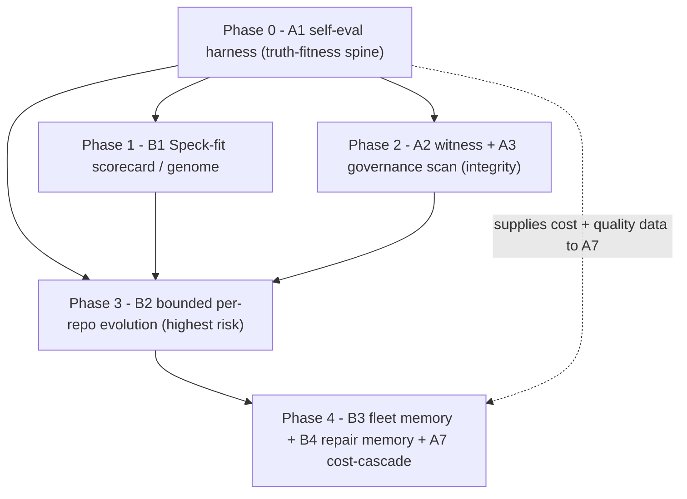

# Speck Frontier SOTA Research Report — metaharness / Darwin Mode (20260707)

> Scope: a `/speck-frontier-scan`-style deep read of [`ruvnet/metaharness`](https://github.com/ruvnet/metaharness) and its research lineage, synthesized into eight prioritized, dependency-aware initiatives for evolving Speck itself and for evolving Speck within each repo it is installed in. Analysis + roadmap only — no methodology code changed by this report.

## 1. Executive Summary

**The one-sentence finding: metaharness is the empirical mirror of Speck.** Both projects make the same bet — that an LLM's real-world reliability is decided by the *harness* (the operating system around the model: planner, memory, verifier, context policy, gates), not by the model weights. metaharness states it as a slogan — *"The model is replaceable. The harness is the product."* Speck states it as a thesis — *"you cannot out-enumerate an agent that is optimizing for green"* ([docs/v8/v8-north-star.md](../v8/v8-north-star.md)). The difference is method, and that difference is the entire opportunity:

- **Speck is normative and asserted.** It writes down the principles that *should* produce truth (P1–P4) and enforces them with human/agent discipline. It has near-zero measurement of whether its own gates actually catch defects. Its strongest efficacy claim today is an anecdote ("4 critical defects across 9 stories" in `AGENTS.md`).
- **metaharness/Darwin is empirical and measured.** It treats the harness as a search target, runs candidate harnesses against a benchmark in a sandbox, and keeps only variants that *measurably* improve under a frozen external scorer with a strict promotion gate — and it treats an honest failure ("found nothing to promote") as a first-class, signed, replayable result.

Speck's biggest structural blind spot, made obvious by the mirror, is that **it has no fitness function for itself.** It cannot currently answer "does gate X catch more defects than it costs in tokens and context?" — which is precisely the question v8's north star cares about when it argues for *shrinking* the always-on corpus rather than growing it.

**The load-bearing caveat (why we cannot copy Darwin naively).** Darwin's default fitness is *task pass-rate* — literally "green." If Speck were to evolve itself to maximize pass-rate, it would become a green-manufacturing machine: the exact failure mode v8 was written to stop. The resolution is a single inversion that runs through every recommendation in this report: **Speck's fitness must be truth-detection, never green.** Reward defect-catch rate; penalize false-green; the four principles and safety gates are an immutable allowlist that no evolution loop may weaken (mirroring metaharness's mutation-surface allowlist in ADR-071 and safety-rails immutability in ADR-164). With that inversion in place, Darwin's machinery — frozen external scorer (ADR-072), benchmark-immutability, honest-null replay (ADR-235), witness provenance (ADR-011) — becomes exactly the anti-gaming toolkit Speck has been missing.

**External validation of Speck's core bet.** The lineage traces to a 2026 arXiv preprint, ["Meta-Harness: End-to-End Optimization of Model Harnesses"](https://arxiv.org/html/2603.28052) (Lee, Nair, Zhang, Lee, Khattab, Finn — the DSPy/Reflexion research cluster), whose abstract states: *"The performance of LLM systems depends not only on model weights, but also on their harness … Yet harnesses are still designed largely by hand."* That is a research-grade endorsement of what Speck is — and a research-grade argument that a hand-designed harness (which Speck is today) is leaving measured performance on the table.

**The eight initiatives** (detailed in §4), across the two axes you asked about:

- *Axis A — how Speck works in itself:* **A1** self-evaluation harness (the truth-fitness spine); **A2** tamper-evident witness for readiness claims; **A3** governance/security scan of Speck's own agent surface; **A7** measured model cost-cascade for delegated work.
- *Axis B — how Speck evolves within each repo:* **B1** per-repo Speck-fit scorecard/genome; **B2** bounded, measured per-repo evolution of Speck config; **B3** cross-repo fleet memory; **B4** just-in-time failure/repair memory.

**Top recommendation: build A1 first.** It is the spine. You cannot safely score a repo (B1), evolve a config (B2), route models by cost (A7), or *retire* an underperforming gate (the v8 goal) without a truth-detection metric to measure against. A1 converts Speck's four principles from asserted to measured, and it is the one change that makes every other change on this list safe. Everything else sequences off it (§5).

## 2. What metaharness Is (and the twist that matters)

There are **two distinct projects** sharing the "metaharness" name, and conflating them would weaken every downstream conclusion:

1. **The one you linked — [`ruvnet/metaharness`](https://github.com/ruvnet/metaharness)** (aka `agent-harness-generator`, CLI `metaharness`, library `@ruvnet/agent-harness-generator`). A TypeScript + Rust "factory for agent frameworks": point it at a GitHub repo (or a blank slate) and it mints a **branded, repo-aware agent harness** — its own `npx` CLI, MCP server, scoped memory, governance policy, and witness-signed releases — that drops into nine hosts (Claude Code, Codex, pi.dev, Hermes, OpenClaw, RVM, Copilot, OpenCode, GitHub Actions). Its own framing: *"It is not another agent framework. It is a factory for agent frameworks."* This repo carries **239 ADRs** (`docs/adrs/INDEX.md`) and a `568/568` test suite. This is the primary object of study.
2. **The research parent — the arXiv paper** ["Meta-Harness: End-to-End Optimization of Model Harnesses"](https://arxiv.org/html/2603.28052), and a separate Python reference implementation ([`SuperagenticAI/metaharness`](https://github.com/SuperagenticAI/metaharness), `uv tool install superagentic-metaharness`) that implements the paper's outer loop. The paper's contribution is the *idea* that harness code — "instruction files, bootstrap scripts, validation scripts, test flows, routing logic" — is itself an optimization target, searched by an agentic proposer that reads "the source code, scores, and execution traces of all prior candidates through a filesystem." Reported results: +7.7 points over a SOTA context-management system at 4× fewer context tokens on online text classification; gains on IMO-level math retrieval and TerminalBench-2 coding.

The twist that matters for Speck: **the thing being generated and optimized in project (1) is structurally the same kind of object as Speck** — a repo-scoped bundle of skills, agents, policy, memory, and gates. metaharness *mints and measures* such bundles; Speck *is* one such bundle, installed by hand and tuned by human judgment. That makes metaharness the closest available prior art for "how could Speck score, sign, and evolve itself?"

### 2.1 Darwin Mode — bounded empirical self-improvement

The centerpiece is **Darwin Mode** (`@metaharness/darwin`; ADR-070 through ~ADR-198, plus the DGM lineage). Its thesis, verbatim from [ADR-070](https://github.com/ruvnet/metaharness/blob/main/docs/adrs/ADR-070-darwin-mode-self-improving-harness.md): *"an agent modifies its own harness, runs benchmarks, keeps the variants that improve, and builds an archive of successful descendants. The foundation model stays frozen. What improves is the operating system around the model."* It is explicitly Level-2 self-improvement — not prompt tuning (too weak), not model fine-tuning (too risky) — and is grounded in the [Darwin Gödel Machine](https://arxiv.org/abs/2505.22954) (SWE-bench 20.0%→50.0%, Polyglot 14.2%→30.7%, with sandboxing + human oversight).

The loop (ADR-070): **profile** a repo → **generate** a baseline harness → **mutate** one approved surface → **run** each variant in a sandbox (no network, no secrets) → **score** it → **gate** for safety → **archive** the whole parent→child tree (not just the current best) → **sample** the next generation from the *entire* archive, so a weak-looking ancestor can still seed a strong branch. Output is a gitignorable `.metaharness/` work-tree with `archive.json`, `lineage.json`, per-variant traces, and `reports/winner.json`. The command is one line: `npx metaharness evolve ./my_repo --generations 3 --children 5`.

Three properties make it *safe* and therefore borrowable (this is the part Speck needs most):

- **A frozen external scorer with a strict promotion gate** ([ADR-072](https://github.com/ruvnet/metaharness/blob/main/docs/adrs/ADR-072-darwin-scoring-and-promotion.md)). A child replaces its parent only if `final_score > parent + delta (0.05)` **and** `safety_score ≥ 0.95` **and** no test-pass regression **and** zero blocked file writes. Safety lives *inside* the objective as hard penalties (secret exposure −0.30, destructive action −0.25, hallucinated file −0.20), so an unsafe-but-impressive variant scores negative. Crucially, "the child cannot edit the benchmark," the authoritative scorer is kernel code (a variant may *propose* new weights but they only take effect if they win under the *frozen* scorer), and there is a cost circuit-breaker.
- **Honest-null replay** ([ADR-235](https://github.com/ruvnet/metaharness/blob/main/docs/adrs/ADR-235-re-executing-verifiers-and-honest-null-replay.md)). A run that promotes *nothing* is a valid, signed, replayable result — not a broken one. Verifiers *re-execute the gate from sealed inputs and trust no service logs* ("trust none of the logs"), recomputing every hash and re-running the real promotion rule to assert the decision reproduces bit-for-bit. This is the discipline that lets you publish negatives honestly.
- **Program-synthesis framing with a scorecard as the deliverable** ([ADR-041](https://github.com/ruvnet/metaharness/blob/main/docs/adrs/ADR-041-metaharness-as-program-synthesis.md)): *"don't 'write a scaffold' — search over harness designs, simulate tasks, score reliability/cost/latency/safety, mutate topology, and emit the best executable artifact + a scorecard … The killer feature is the scorecard, not generation."*

### 2.2 The surrounding mechanisms Speck can learn from

Beyond Darwin, four shipped surfaces are directly relevant:

- **`metaharness score <repo>`** ([ADR-041](https://github.com/ruvnet/metaharness/blob/main/docs/adrs/ADR-041-metaharness-as-program-synthesis.md)): a no-exec, deterministic, `--json`-for-CI report card. Six dimensions, each derived from real repo signals (not invented): harness fit, compile confidence, task coverage, tool safety, memory usefulness, est. $/run, plus a recommended mode. The scaffolded-harness variant (`harness score`, `score-harness` skill) grades 0–100 with an A/B/C/F letter and exit codes (0/1/2), and emits a 6-field badges block for the README.
- **`harness genome <repo>`** — a 7-section categorical report (agent topology, risk, MCP surface, test confidence) used to fingerprint a repo before scaffolding.
- **`harness mcp-scan` / `threat-model`** ([ADR-022](https://github.com/ruvnet/metaharness/blob/main/docs/adrs/ADR-022-mcp-primitive.md)): *"npm audit for agent tools"* — a static-only scan of the declared MCP/tool surface flagging shell/network grants, missing audit/timeouts, wildcard permissions, unguarded secrets, and unpinned deps; `--fail-on high` exits non-zero. MCP is default-deny (no network, no shell, no file-write, approve-dangerous, 30s timeout, 8 calls/turn, audit on).
- **Witness + provenance** ([ADR-011](https://github.com/ruvnet/metaharness/blob/main/docs/adrs/ADR-011-witness-and-provenance.md)): an Ed25519-signed `witness.json` over RFC 8785 canonical JSON, attesting file/fix/memory checksums against a commit, plus an append-only `verification-history.jsonl` temporal log (bisect-free regression triage), deterministic-seed regeneration, key rotation, in-toto/SLSA wrapping, and npm provenance as a complementary signature.

Additional levers worth noting but lower-priority for Speck: a learned model **router** (`@metaharness/router` / tiny-dancer FastGRNN with uncertainty + circuit-breaker), a cost-cascade (escalate only failed cheap attempts to a frontier model), a **cost-Pareto leaderboard** (benchmark-per-dollar), and cross-instance **federation** ([ADR-014](https://github.com/ruvnet/metaharness/blob/main/docs/adrs/ADR-014-self-evolution-and-federation.md)).

## 3. The 4-Angle SOTA Audit

Each angle contrasts what metaharness does at the frontier against Speck's current baseline (drawn from a full read of `.cursor/skills/`, `.speck/scripts/`, and the v8 north star). The recurring pattern: **Speck has the richer *normative* design; metaharness has the *measurement and integrity* Speck lacks.**

### Angle 1: Architectures & Execution Topologies

**Frontier findings.** metaharness treats harness production as *population-based search*, not authorship. Darwin Mode keeps an **archive/lineage tree** and samples the next generation from the whole archive (ADR-070), deliberately avoiding hill-climbing's local optima — the "descendant potential over raw score" insight from the Huxley–Gödel line. It separates two evolution timescales that Speck collapses into one: **generation-time population search** (fork the harness source, evaluate structural variants offline) versus **run-time bandit tuning** of live config knobs (ADR-014). Execution is capability-diverse: nine host adapters from one output, an RVM hardware-isolated sandbox for untrusted peers, and a default-deny sandbox for every variant run.

**Speck baseline comparison.** Speck's topology is strong and arguably ahead on *orchestration discipline*: the conductor/worker pattern, worktree-isolated parallel epics, the verify-skills gate, and the orchestration ledger ([.speck/patterns/learned/process/parallel-epic-execution.md](../../.speck/patterns/learned/process/parallel-epic-execution.md)) are more mature than anything in metaharness's docs for *coordinating* multi-agent build work. Where Speck is behind: it has **no population/archive concept** and **no separation of generation-time vs run-time adaptation**. Speck evolution is a single, human-paced narrative timescale (retro → pattern → maybe a GitHub issue). It also has no sandbox of its own for trying methodology variants — changes to Speck are applied directly to the live methodology and judged by taste. The learned-pattern library that should hold cross-project structural wins is almost entirely empty `.gitkeep` placeholders (only `parallel-epic-execution.md` is real), which tells us the promotion pipeline exists on paper but rarely fires.

### Angle 2: Context Engineering & Retention

**Frontier findings.** The arXiv paper's headline is a *context* result: +7.7 points at **4× fewer context tokens** — i.e., a better harness is a more *context-efficient* one, not just a more capable one. metaharness's memory is **retrieval-based and typed**: ruVector HNSW vector archives, ReasoningBank, and Reflexion (structured failure → repair memory) retrieved on uncertainty/novelty/dep-risk (Self-RAG), with `@ruvector/emergent-time` providing memory decay. The Darwin archive is literally a vector-search problem (ADR-260 in the RuVector repo replaces the filesystem archive with an HNSW-backed one for O(log n) selection). "The filesystem is the source of truth" — prior candidates' code, scores, and traces are all on disk and re-readable by the proposer.

**Speck baseline comparison.** Speck has thought hard about context rot — it is a named enemy in the v8 north star ("more probes → more precise green manufacturing"), and v8's answer (lazy-loaded patterns via `disable-model-invocation: true`, collapsed skills, alias shims, `project-state.md` as the single first-read) is a *legitimately strong* context-engineering stance that metaharness does not match. The gap is **retrieval vs. harvest**: Speck's failure/repair memory is git commit tags (`GOTCHA:`, `DEBT:`) that are *harvested at retro time* by `git log --grep`. There is no just-in-time retrieval of "have we hit this failure before?" at plan or audit time, no ranking, no embedding index, no decay. Reflexion/ReasoningBank is the missing capability (initiative B4). Speck also has no *token-cost* measure of context, so it cannot demonstrate its own context-efficiency wins the way the paper does — it asserts the corpus is smaller without measuring the savings.

### Angle 3: Agent Verification, Reliability & Reward Hacking (the richest angle)

**Frontier findings.** This is where metaharness is most instructive because it is fighting the *same enemy Speck names* — an agent optimizing for a proxy — but with mechanism instead of exhortation:

- **A frozen external scorer the candidate cannot edit** (ADR-072). The benchmark and test command live outside the mutable surface; a variant may *propose* a new scoring policy but it is only adopted if it wins under the *current frozen* scorer. This is a concrete answer to "who grades the grader?"
- **A promotion gate with an anti-noise margin and non-regression clause** (ADR-072). "Better" must exceed measurement jitter (`+delta`) and must not trade test-pass-rate for speed/cost. Safety is *inside* the objective as hard penalties, so "safety theatre" scores negative.
- **Benchmark integrity as a first-class concern**: hidden tests, randomized task seeds across generations, and immutability of the task list (ADR-072). The child literally *cannot cheat* the eval.
- **Re-executing verifiers + honest-null replay** (ADR-235): don't trust a signed *verdict*; **re-run the gate on sealed scores** and assert it reproduces bit-for-bit. A zero-promotion run is a valid signed result. The README even polices its own marketing ("do not use its synthetic promotion as marketing evidence").

**Speck baseline comparison.** Speck's *conceptual* verification design is genuinely excellent and in several ways ahead: the DOES-IT-WORK vs IS-IT-GOOD split, the three non-substitutable axes (CORRECT / ON-CONTRACT / FELT-GOOD), the AI-run naive-hostile LARP, the separately-incentivized auditor (P4), and the verify-skills transcript gate are richer *ideas* than Darwin's scalar scorer. **But every one of them is enforced by assertion, not measurement, and several are known to be gameable:**

- Speck's readiness stamp writes `verified <today>` regardless of whether a runtime run happened; the stamp binds to the *commit SHA*, not the *artifact content* — a file can change within one commit and still read "fresh." Speck's own docs admit "self-reported fields are not tamper-evident (host-runtime limitation)." metaharness's witness (ADR-011) is the missing tamper-evidence; ADR-235's "re-run the gate, trust no logs" is the missing verifier integrity.
- Speck has **no frozen external scorer** for its own gates — the same agent frequently proposes work, validates it, and (absent a separate session) audits it. The v8 "adversary is structural" principle wants a separate evaluator, but nothing *measures* whether separation actually catches more defects.
- Speck has **no seeded-defect benchmark** and therefore **no false-green rate** for any gate. It cannot currently distinguish a gate that catches real defects from a gate that reliably produces green. That is initiative A1, and this angle is the strongest argument for it.

Speck already has one genuine, underused fitness signal: `compute-eval-signals.sh` measures agent commit **override rate** and **code survival rate** from VCS history, with an `EVAL_SIGNAL_DRIFT.P2` threshold. This is a Darwin-style empirical signal hiding in plain sight — it just isn't wired to any evolution loop.

### Angle 4: Spec-Driven Development (SDD)

**Frontier findings.** metaharness reframes scaffolding as **program synthesis under search** (ADR-041): a repo is analyzed (AST + dep-graph + README/test discovery), capabilities are inferred, candidate harnesses are generated by beam search, topology is optimized (MCTS/UCT with a GNN value net), validated by constraint solving over hard requirements, and scored — with the explicit discipline "keep only measured wins" (DRACO, ADR-037–040) and an acceptance bar stated as numbers ("≥8/10 unknown repos install, ≥7/10 pass smoke, avg generation cost < $0.25"). The output is *the scorecard*, and the scorecard's dimensions are all derived from real repo signals.

**Speck baseline comparison.** Speck's SDD spine (Promise → Build → Prove, the traceability matrix as a promise-conservation ledger, experience-chains, the evidence contract) is *substantially more sophisticated* than metaharness's requirement handling — metaharness has nothing like promise conservation or a magic-moment contract. The gap is at the two ends: **(a) intake** — Speck has no `score <repo>`/`genome` equivalent that reads a repo and *recommends a configuration* (play level, which optional artifacts, which probes); the human picks the play level by feel. And **(b) the measured-win discipline for the methodology itself** — metaharness pins every ADR to a measured acceptance test; Speck's own methodology changes ship on judgment and CHANGELOG prose, with no requirement that a proposed gate demonstrate a measured lift on a benchmark before it enters the always-on corpus. Adopting DRACO's "keep only measured wins" bar for Speck's *own* gate changes (backed by A1) is the highest-integrity way to keep the v8 promise of a shrinking, earning-its-keep corpus.

## 4. High-Value Deltas & Canonical Mapping

Eight initiatives, each routed to a real canonical home per the `AGENTS.md` routing table. Impact/Effort/Risk are High/Med/Low. "Risk" is *risk to Speck's integrity if built carelessly*, not build risk.

| ID | Initiative | Axis | Target canonical home | Impact | Effort | Risk |
|----|-----------|------|-----------------------|--------|--------|------|
| FTR-A1 | Self-evaluation harness (seeded-defect corpus + per-gate defect-catch / false-green / cost) | A (Speck itself) | new `.cursor/skills/speck-selfeval/SKILL.md`; corpus under `.speck/eval/fixtures/`; scorer `.speck/scripts/validation/validators/compute-selfeval-signals.sh`; discipline in `evidence-contract-template.md` | High | High | Med |
| FTR-A2 | Tamper-evident witness for readiness/truth claims (Ed25519 + content hash + honest-null replay) | A | evolve `.speck/scripts/stamp-truth.sh` + new `.speck/scripts/witness/*`; verify hook in `validate-template.sh`; discipline in `AGENTS.md` (SHA-stamp section) + `evidence-contract-template.md` | High | Med | Low |
| FTR-A3 | Harness governance/security scan of Speck's own agent surface (mcp-scan analog) | A | new `.speck/scripts/validation/validators/harness-governance-scan.sh`; wired into `.cursor/skills/speck-recheck/SKILL.md`; policy note in `AGENTS.md` | Med | Med | Low |
| FTR-A7 | Measured model cost-cascade for delegated/subagent work (cheap→frontier escalate-only-on-fail) | A | `.cursor/skills/model-selection/SKILL.md`; delegated-execution section of `AGENTS.md`; `.speck/patterns/learned/process/` | Med | Med | Low |
| FTR-B1 | Per-repo Speck-fit scorecard / genome (0-100 + recommended config, no-exec, `--json`) | B (per-repo) | new `.cursor/skills/speck-genome/SKILL.md`; `.speck/scripts/` + `packages/cli/` subcommand; feeds `.cursor/skills/project-specify/SKILL.md` play-level choice | High | Med | Low |
| FTR-B2 | Bounded, measured per-repo evolution of Speck config (Darwin-adapted; immutable P1–P4) | B | new `.cursor/skills/speck-evolve/SKILL.md`; archive under `.speck/evolution/`; safety allowlist + human-review gate in `AGENTS.md`; fitness from `compute-eval-signals.sh` + FTR-A1 | High | High | High |
| FTR-B3 | Cross-repo fleet memory / federation of validated learned patterns | B | `.speck/patterns/learned/` + shared-store convention; `.cursor/skills/project-retrospective/SKILL.md` + `speck-learn`; `packages/cli/` sync | Med | Med | Med |
| FTR-B4 | Just-in-time failure/repair memory (Reflexion-style retrieval at plan/audit time) | B | `.speck/patterns/learned/` (retrieval index); `.cursor/skills/speck-learn/SKILL.md`, `story-plan`, `speck-audit` | Med | Med | Low |

### FTR-A1 — Self-evaluation harness (the spine)

**What.** A checked-in corpus of ~15–30 *seeded-defect fixtures*: each is a small, self-contained Speck artifact set (a `spec.md` + a deliberately flawed `validation-report.md`/implementation) carrying exactly one planted defect of a known class. Defect classes map to the four principles so the corpus tests what Speck claims to protect: fake-green readiness claim (P1), fabricated evidence path (P2), unreachable-control-skipped-as-blocker (P3), self-audit-with-no-separate-evaluator (P4), missing traceability row, price-without-substitute (value defensibility), banned-language leak. Run each relevant gate/skill over each fixture and record, per gate: **defect-catch rate** (did it flag the planted defect?), **false-green rate** (did it pass a flawed fixture?), **false-positive rate** (did it flag a clean control fixture?), and **token/wall-clock cost**.

**Why it's the spine.** It turns "P1–P4 work" from assertion into a number, and — critically for v8 — it lets Speck *retire* a gate that doesn't catch defects it costs tokens to run. It is the fitness function every other initiative needs.

**Borrowed mechanism.** ADR-072's frozen external scorer (the corpus and the pass/fail oracle are *not* editable by the gate under test) and ADR-235's honest-null discipline (a scan that catches nothing on a clean corpus is a valid result, not a broken run). Keep held-out fixtures so skills can't be tuned to memorize the visible set.

**Guardrail.** Fitness = truth-detection. Never score a gate by how often it produces green.

### FTR-A2 — Tamper-evident witness for truth claims

**What.** Upgrade the honor-system stamp into a signed attestation. Today `stamp-truth.sh` writes `*[as of SHA <commit> | verified <today> | speck v8.0.0]*` — bound to the commit, not the content, with a date that is merely "today." Add an Ed25519 witness (RFC 8785 canonical JSON) that hashes (a) the artifact body, (b) the referenced evidence files (screenshots, LARP recordings), and (c) the commit, and records them in an append-only `verification-history.jsonl`. A readiness claim then cryptographically binds "this green, over this content, with these evidence files, at this commit."

**Why.** It directly attacks fake-green — the enemy Speck names most often — and closes the acknowledged "self-reported fields are not tamper-evident" gap. The temporal log gives bisect-free regression triage ("when did PRM-014 stop being satisfied?"). Pairs naturally with the verify-skills gate.

**Borrowed mechanism.** ADR-011 in full (deterministic seed, rotation, in-toto/SLSA wrap, npm-provenance complement), plus ADR-235's "re-run the gate on sealed scores, trust no logs" as the verify step.

**Scope honesty.** Signing does not make a claim *true*; it makes a claim *tamper-evident and re-checkable*. The truth still comes from A1/LARP/audit. Market it exactly that way (metaharness is scrupulous about this distinction).

### FTR-A3 — Harness governance/security scan

**What.** A static, no-exec scan of the agent surface *Speck itself installs and the project accretes*: `.cursor/mcp.json` / `.mcp.json`, `.claude/settings*.json`, hooks, and agent tool grants. Flag shell/network/file-write grants, wildcard permissions, unpinned MCP server deps (`npx -y ...@latest`), unguarded secret reads, and missing timeouts/audit. `--fail-on high` exits non-zero; wire it into `/speck-recheck` as a new drift probe (`HARNESS_GOV_DRIFT`).

**Why.** Speck scans *product* surfaces (banned-language over `src/`) and Claude settings drift, but never security-audits the *tool/MCP surface it runs on*. This is a clean, self-contained gap with an obvious template.

**Borrowed mechanism.** `mcp-scan` / `threat-model` (ADR-022) and the default-deny posture (no network/shell/file-write, approve-dangerous, timeouts, audit-on) as the recommended baseline for Speck-managed MCP config.

### FTR-A7 — Measured model cost-cascade for delegated work

**What.** Turn advisory `model-selection` into a *policy* for Speck's own delegated execution: draft with the cheapest sufficient model, escalate to a frontier model **only** when the cheap attempt fails a gate (mirroring metaharness's empty-patch cascade). Record per-skill model tier + measured cost/quality (from A1) so the recommendation is grounded, not guessed. Implemented through the Task tool's `model` parameter for subagents.

**Why.** Speck has zero cost telemetry and only human-prompt model switching. A cascade is the single highest-ROI cost lever and it composes with A1 (which supplies the per-gate quality/cost numbers).

**Borrowed mechanism.** Cost-cascade + cost-Pareto framing (ADR-040/179/182); the router (tiny-dancer) is noted as a *later* option — Speck can't route mid-session on most hosts, so the cascade (sequential escalation) is the pragmatic form.

### FTR-B1 — Per-repo Speck-fit scorecard / genome

**What.** `speck genome` / `speck score` (CLI + `/speck-genome` skill): a no-exec, deterministic, `--json`-for-CI read of a repo that emits a 0-100 card and a *recommended Speck configuration* — play level (sprint/build/platform), which optional artifacts to require (architecture, ux-strategy, design-system), which `/recheck` probes matter, and recommended model tiers. Dimensions adapt metaharness's six to Speck's world: **spec coverage** (are truth artifacts present + fresh?), **evidence health** (readiness stamps + LARP artifacts vs. claims), **drift exposure** (staleness/schema/promise), **agent-surface safety** (from A3), **methodology fit** (repo archetype × play level), and **est. cost/gate-run** (from A7).

**Why.** It replaces the human's play-level guess at `/project-specify` with an evidence-based recommendation, gives a repeatable CI health number, and is the most visible "killer feature" steal — directly analogous to metaharness's `score <repo>`, which its own author calls "the killer feature."

**Borrowed mechanism.** ADR-041's no-exec analyzer (inventory → analyze → recommend) and the `score-harness` skill's grade/exit-code/badges shape.

### FTR-B2 — Bounded, measured per-repo evolution of Speck config

**What.** `/speck-evolve`: treat the repo's Speck *config* as a genome (staleness window, scorecard caps, which optional gates/probes run, model tiers, project-local rules) and evolve it against a **truth-fitness** = existing `compute-eval-signals.sh` (agent override ↓, code survival ↑) + drift-recurrence ↓ + FTR-A1 defect-catch on repo-local fixtures. Keep only mutations that measurably improve fitness under a strict promotion gate; archive the parent→child lineage to `.speck/evolution/`.

**Why.** It makes Speck's stated aspiration — "each project makes Speck better" — *measured* rather than vibes, and adapts the config to the repo instead of one-size defaults.

**Borrowed mechanism.** The whole Darwin loop: archive-not-hill-climb (ADR-070/073), strict promotion gate with anti-noise delta + non-regression (ADR-072), immutable mutation allowlist (ADR-071) and safety-rails immutability (ADR-164), human-review gate (ADR-166).

**Guardrail (highest-risk item).** The mutation surface **must exclude P1–P4 and all safety gates** — they are immutable. Fitness **must be truth-detection**, never pass-rate. Without both, this initiative becomes the green-manufacturing machine v8 exists to prevent. This is why it sequences last among the core items, only after A1 (fitness) and A2 (auditable/signed lineage) exist.

### FTR-B3 — Cross-repo fleet memory / federation

**What.** Promote validated `learned/` patterns across the repos in a workspace (your `~/Code` has several Speck installs — `ro`, `keegt`, etc.), via a shared store convention (e.g. a synced `~/.speck/patterns/learned/`), with drift detection when the "same" pattern diverges between repos.

**Why.** Today learnings are trapped per-repo unless a human files a GitHub issue; the central `TEMPLATE-FEEDBACK.md` and CI workflows referenced by the tooling are missing. Fleet memory is how one repo's discovery becomes another's default.

**Borrowed mechanism.** ADR-014 cross-instance federation + ADR-011 witness federation ("did we drift apart?" via signature comparison).

**Risk.** Cross-repo promotion can propagate a *bad* pattern workspace-wide; gate promotion on A1 evidence and keep provenance (which repo/retro validated it).

### FTR-B4 — Just-in-time failure/repair memory

**What.** Make failure memory *retrieval-based* and available *at plan/audit time*, not just harvested at retro. When starting a story plan or an audit, retrieve "have we hit this failure class here before, and what fixed it?" from an indexed repair memory seeded by `GOTCHA:`/`DEBT:` tags and audit findings.

**Why.** Speck currently learns *between phases* (retro→pattern); Reflexion-style retrieval lets it learn *within* a project, at the moment of relevance. Cheap, low-risk, and it makes B3's fleet memory actually consumed rather than archived.

**Borrowed mechanism.** Reflexion + Self-RAG retrieval (ADR-041 stage table) and ReasoningBank; a lexical index is enough for v1 (embeddings optional later).

## 5. Proposed Action Plan — Prioritized, Dependency-Aware Roadmap

Sequenced by dependency, integrity-risk, and the v8 mandate to *shrink* the corpus. Each phase carries a metaharness-style **numeric acceptance bar** (borrowing the DRACO "keep only measured wins" discipline) so a phase is either measurably done or it is not.

**Phase 0 — A1 self-evaluation harness.** *Nothing safe happens without it.* Build the seeded-defect corpus and the per-gate scorer. This is also the highest-integrity single change: it lets Speck prove (or disprove) that each gate earns its context cost, which is the operational form of the v8 promise.
- *Acceptance bar:* ≥15 fixtures across ≥6 defect classes with held-out controls; a per-gate report (defect-catch %, false-green %, false-positive %, median token cost) reproducible from a clean checkout; at least one gate identified as either a clear keep or a clear prune candidate on the evidence.

**Phase 1 — B1 Speck-fit scorecard / genome.** With a fitness signal available, ship the no-exec repo card + recommended config. Immediately useful at every `/project-specify` and as a CI health number; tractable on existing `/recheck` + scan machinery.
- *Acceptance bar:* deterministic `--json` output on ≥5 diverse repos; the recommended play level matches an expert's choice on ≥4/5; every dimension derives from a real repo signal (no invented numbers), mirroring ADR-041's rule.

**Phase 2 — A2 witness + A3 governance scan.** Harden trust before anything auto-evolves. A2 first (it attacks fake-green directly and is a prerequisite for auditable evolution lineage); A3 alongside (self-contained, low risk).
- *Acceptance bar (A2):* a readiness claim's witness verifies on a clean tree and fails on a one-byte change to the artifact *or* a referenced evidence file; the gate re-executes from sealed inputs and reproduces the verdict bit-for-bit; an honest-null (no green claimed) verifies as valid. *(A3):* the scan flags a planted wildcard/`--latest`/secret-read grant and `--fail-on high` exits non-zero.

**Phase 3 — B2 bounded per-repo evolution.** Only now — with truth-fitness (A1), a config surface (B1), and signed lineage (A2) in place — is it safe to let a repo tune its own Speck knobs. Ship with the immutable P1–P4 allowlist and a mandatory human-review gate.
- *Acceptance bar:* an `.speck/evolution/` archive with parent→child lineage; ≥1 promoted config change that measurably improves truth-fitness (override/drift/defect-catch) with **zero** weakening of any P1–P4 or safety gate; a zero-promotion run recorded as a valid honest-null; every promotion signed (A2) and human-approved (ADR-166).

**Phase 4 — B3 fleet memory + B4 repair memory + A7 cost-cascade.** Scale the single-repo loop across the workspace and make it cheap. B4 makes memory *consumed at plan/audit time*; B3 federates validated patterns across repos; A7 drives cost down via measured escalation.
- *Acceptance bar:* a pattern validated in one repo becomes available in another with provenance intact; a plan/audit run retrieves a relevant prior failure without a full retro; a delegated task demonstrably escalates to a frontier model only after a cheap-tier gate failure, with the cost delta recorded.

**Cross-cutting, do-alongside:** adopt a lightweight **Speck-self decision log** (see §6) so each phase's locked choices carry a "measured-win-required" rationale tied to A1 — the discipline that keeps the corpus honest as it changes.

## 6. Risks, the Anti-Pattern, and Two Meta-Findings

### 6.1 The anti-pattern: never optimize Speck for green

This is the single most important sentence in the report. metaharness's default fitness is *task pass-rate*. Speck's entire v8 thesis is that **an agent optimizing for green will manufacture green without truth.** Therefore any measurement, scorecard, or evolution loop Speck borrows must be inverted:

- **Fitness is truth-detection, not pass-rate.** Reward defect-catch; penalize false-green and false-positive; treat drift-recurrence and agent-override as costs. A gate that produces more green is *suspect*, not rewarded.
- **The four principles and safety gates are immutable.** They belong on the never-mutate allowlist (metaharness's ADR-071/164 pattern). Evolution may tune thresholds, probe selection, staleness windows, and model tiers — never whether P1–P4 apply.
- **The scorer is frozen and external to the thing it grades.** The self-eval corpus (A1) and its oracle are not editable by the gate under test; a skill may *propose* changes to its own rubric, but the proposal is judged by the *current frozen* scorer (ADR-072).
- **Honest nulls are first-class.** A scan that finds nothing, an evolution run that promotes nothing, a repo that scores low — all are valid, signed, publishable results, never massaged upward (ADR-235). This is the exact behavior Speck's banned-phrase detector already wants; A1/A2 give it teeth.

If those four hold, Darwin's machinery strengthens Speck. If any one is dropped, the same machinery becomes a faster way to lie. That trade is the whole game.

### 6.2 Other risks

- **Corpus rot (A1).** A seeded-defect corpus can itself go stale or be gamed. Mitigation: held-out fixtures, periodic refresh via `/speck-frontier-scan`, and rotating seeds (ADR-072 benchmark-integrity).
- **Cost of measurement.** Running gates over a corpus and evolving configs costs tokens. Mitigation: A7 cost-cascade for the eval runs themselves; keep the corpus small and high-signal; run A1 on a cadence, not every commit.
- **Signing key management (A2).** A witness key is real operational weight. Mitigation: deterministic-seed + rotation model from ADR-011; default to the offline Ed25519 path, Sigstore optional.
- **Over-engineering / scope creep.** metaharness has 239 ADRs; Speck's v8 north star warns against exactly that kind of accretion. Mitigation: this roadmap is five phases, and every item must clear a *measured* acceptance bar before it enters the always-on corpus — a change that can't show a lift on A1 does not ship.

### 6.3 Two meta-findings surfaced by this scan

1. **`/speck-frontier-scan` has no methodology-repo output home.** Its skill hard-codes the report path to `specs/projects/<PROJECT_ID>/project-frontier-research-report-<YYYYMMDD>.md` and lists "active project specs directory" as a prerequisite. In *this* repo (Speck itself), there is no such project, which is why this report lives in `docs/frontier/`. Small delta: give the skill a "methodology-repo mode" that routes to `docs/frontier/` when `.speck/` is the repo's own source rather than an install. Canonical home: `.cursor/skills/speck-frontier-scan/SKILL.md`.
2. **The Speck repo does not use a decision-log/ADR discipline for its own evolution.** `project-decisions-log.md` (DEC entries) is for *product* projects; Speck-the-methodology records its own choices only in `CHANGELOG.md` prose and one-off `docs/` essays. metaharness's 239 ADRs (with per-ADR *measured acceptance tests*) are the counter-model. Adopting a lightweight self-ADR log — `docs/adrs/` or `docs/decisions/`, one entry per methodology change, each tied to an A1 measurement — is the highest-leverage way to keep the v8 promise that the corpus only grows when a change *earns* it. This is the cross-cutting item in §5.

### 6.4 Bottom line

metaharness doesn't threaten Speck's thesis — it *confirms* it (the harness is the product) and supplies the one thing Speck never built: **a way to measure whether the harness actually works.** Speck's principles are, if anything, more sophisticated than Darwin's scalar scorer. The opportunity is not to replace Speck's normative spine with metrics; it is to give that spine an empirical nervous system — starting with A1 — so that "find what is wrong" (P1) finally applies to Speck itself, and so the next thing added to Speck has to *prove it belongs* before it costs another token of anyone's context.

## Appendix A — Source ADR Index (metaharness)

The metaharness ADRs most load-bearing for this report (from `ruvnet/metaharness/docs/adrs/`, 239 total):

- [ADR-011 — Witness manifest + provenance](https://github.com/ruvnet/metaharness/blob/main/docs/adrs/ADR-011-witness-and-provenance.md) → FTR-A2.
- [ADR-014 — Self-evolution + federation](https://github.com/ruvnet/metaharness/blob/main/docs/adrs/ADR-014-self-evolution-and-federation.md) → FTR-B2, FTR-B3 (run-time bandit tuning; cross-instance federation).
- [ADR-022 — MCP primitive (default-deny)](https://github.com/ruvnet/metaharness/blob/main/docs/adrs/ADR-022-mcp-primitive.md) → FTR-A3.
- ADR-037–040 — DRACO "keep only measured wins" + cost-optimal routing → FTR-A1, FTR-A7, and the measured-win discipline (§4/§6).
- [ADR-041 — MetaHarness as program synthesis + search](https://github.com/ruvnet/metaharness/blob/main/docs/adrs/ADR-041-metaharness-as-program-synthesis.md) → FTR-B1 (the scorecard-is-the-product framing).
- [ADR-070 — Darwin Mode: bounded empirical self-improvement](https://github.com/ruvnet/metaharness/blob/main/docs/adrs/ADR-070-darwin-mode-self-improving-harness.md) → FTR-B2 (the loop, archive-not-hill-climb).
- ADR-071 — Darwin mutation surfaces + hard safety allowlist → FTR-B2 (immutable allowlist).
- [ADR-072 — Darwin scoring + promotion model](https://github.com/ruvnet/metaharness/blob/main/docs/adrs/ADR-072-darwin-scoring-and-promotion.md) → FTR-A1, FTR-B2 (frozen scorer, promotion gate, benchmark integrity).
- ADR-073 — Darwin archive + selection (evolve like species) → FTR-B2.
- ADR-164 — Darwin safety-rails immutability; ADR-166 — human-review gates → FTR-B2 guardrails.
- ADR-179/182 — cost-Pareto leaderboard + cost-cascade → FTR-A7.
- [ADR-235 — Re-executing verifiers + honest-null replay](https://github.com/ruvnet/metaharness/blob/main/docs/adrs/ADR-235-re-executing-verifiers-and-honest-null-replay.md) → FTR-A1, FTR-A2 (trust-no-logs; honest nulls).

## Appendix B — Primary Sources

- Repo (studied): [`ruvnet/metaharness`](https://github.com/ruvnet/metaharness) (aka `agent-harness-generator`).
- Research parent: ["Meta-Harness: End-to-End Optimization of Model Harnesses"](https://arxiv.org/html/2603.28052), arXiv 2026 (Lee, Nair, Zhang, Lee, Khattab, Finn); reference impl [`SuperagenticAI/metaharness`](https://github.com/SuperagenticAI/metaharness).
- Darwin Gödel Machine (empirical harness evolution): [arXiv 2505.22954](https://arxiv.org/abs/2505.22954).

## Appendix C — Speck Baseline Sources

Baseline drawn from a full read of the Speck v8.0.0 tree, notably: [docs/v8/v8-north-star.md](../v8/v8-north-star.md) (four principles), [AGENTS.md](../../AGENTS.md) (readiness states, host matrix, verify-skills gate), `.cursor/skills/speck-recheck/SKILL.md` and `speck-reprove/SKILL.md` (drift + v8 re-prove), `.speck/scripts/stamp-truth.sh` and `staleness-check.sh` (SHA stamp mechanics), `.speck/scripts/validation/validators/compute-eval-signals.sh` (VCS-as-eval override/survival signals — the existing latent fitness signal), `.cursor/skills/model-selection/SKILL.md` (advisory model choice), and `.speck/patterns/learned/` (largely empty `.gitkeep` scaffolding).

---

*[as of SHA `2e7a6c5` | verified 2026-07-07 | speck v8.0.0]*
