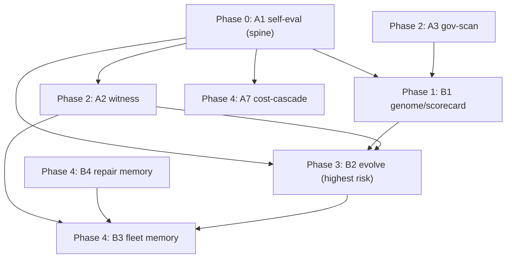

# metaharness -> Speck: Full Implementation Plan

> **Companion to** [metaharness-frontier-report-20260707.md](metaharness-frontier-report-20260707.md) (the *why*). This doc is the *how* — a durable, pick-up-anytime execution plan for all eight initiatives plus cross-cutting work. It is written so a fresh agent or a future you can resume mid-stream: read the report, read §0-§3 here, then execute the initiative sections in phase order, checking off the master list in §5.

---

## 0. Pick-up protocol (read this first when resuming)

1. **Read** the [frontier report](metaharness-frontier-report-20260707.md) for the thesis and the eight initiatives (A1-A7, B1-B4).
2. **Internalize the one rule** (§1). Every scorer, gate, and evolution loop here obeys it.
3. **Apply the shared conventions** (§3) to every new skill/script/fixture — they are not repeated in each initiative.
4. **Execute in phase order** (§2). Phase 0 (A1) is the spine; nothing downstream is safe without it.
5. **Track status** in the master checklist (§5). Each initiative also carries its own `Status:` line — update it as you go.
6. **Confirm open choices** (§6) with the human before building the item they gate.

**Status legend:** `NOT STARTED` · `IN PROGRESS` · `BLOCKED` · `DONE`. Effort: `S` (<0.5 day) · `M` (0.5-2 days) · `L` (2-5 days).

**This repo is Speck itself** — "build" means new skills (`.cursor/skills/`), scripts (`.speck/scripts/`), fixtures, templates, and CLI, distributed to consumer projects via `speck upgrade`. It is *not* a product-using-Speck, so there is no `specs/projects/<id>/`; methodology reports land in `docs/frontier/`.

---

## 1. The load-bearing guardrail (applies to EVERY initiative)

**Fitness is truth-detection, never green.** metaharness/Darwin defaults to optimizing *pass-rate*; Speck's v8 north star exists to stop exactly that. So, universally:

- **Reward defect-catch; penalize false-green and false-positive.** A gate/config that produces *more green* is suspect, not rewarded.
- **P1-P4 and all safety gates are immutable.** They live on a never-mutate allowlist (mirrors metaharness ADR-071/164). Evolution/config may tune thresholds, probe sets, staleness windows, model tiers — never whether the four principles apply.
- **The scorer is frozen and external to what it grades** (ADR-072). The eval oracle is not editable by the gate under test.
- **Honest nulls are first-class** (ADR-235). "Found nothing / scored low / promoted nothing" is a valid, signed, publishable result — never massaged upward.
- **Scope honesty.** Signing (A2) makes a claim tamper-evident, not *true*. Truth still comes from A1/audit/LARP. Market every mechanism as exactly what it is.

If any one of these is dropped, the borrowed machinery becomes a faster way to lie.

---

## 2. Phase map & dependency graph

| Phase | Initiatives | Theme | Gate to start |
|-------|-------------|-------|---------------|
| 0 | A1 | Truth-fitness spine | none |
| 1 | B1 | Onboarding intelligence | A1 (soft), A3 (soft) |
| 2 | A2, A3 | Integrity | A1 |
| 3 | B2 | Bounded adaptation | A1 + B1 + A2 |
| 4 | A7, B3, B4 | Scale-out | A1 (A7), A2+B2 (B3) |
| X | CC1-CC3 | Cross-cutting | any time |

---

## 3. Shared conventions (apply to every initiative)

Derived from a full read of the Speck v8.0.0 tree. Follow these so new pieces are indistinguishable from native ones.

### 3.1 Validator scripts (`.speck/scripts/validation/validators/*.sh`)
- Portable **bash 3.2**; `set -euo pipefail`; the standard color block (`RED/GREEN/YELLOW/BLUE/NC`).
- Arg parse: `--strict` (or a positional `true`/`false` like `validate-readiness-evidence.sh`), plus a trailing positional path/root. Model on [compute-eval-signals.sh](../../.speck/scripts/validation/validators/compute-eval-signals.sh).
- **Exit codes: `0` pass/skip · `1` defect (under `--strict`) · `2` usage/config error.** Missing target file → `exit 0` (silent skip), matching every artifact validator.
- Emit a human report **and** a machine summary line (e.g. `SELFEVAL_SUMMARY ...`, mirroring `EVAL_SIGNAL_DRIFT_SUMMARY`). `--json` is *not* a current convention — the eval/genome scorers introduce it deliberately (it is genuinely needed for CI + B1 consumption); keep text+exit as the primary path.
- No shared bash lib except `profile-lib.sh`; heavy parsing uses embedded Python heredocs (see `validate-template.sh`).

### 3.2 Self-tests
- Bash `*.test.sh` next to the script: `set -euo pipefail`, `mktemp -d`, `trap 'rm -rf "$TMP"' EXIT`, expect-fail via `if bash script ...; then echo FAIL; exit 1; fi`. Model on [compute-eval-signals.test.sh](../../.speck/scripts/validation/validators/compute-eval-signals.test.sh).
- **Manually append** the new `.test.sh` to the root [package.json](../../package.json) `"test"` chain (there is no auto-discovery). Node CLI tests use `node:test` + `node:assert/strict`.

### 3.3 Skills (`.cursor/skills/<name>/SKILL.md`)
- Frontmatter: `name` (kebab, == dir), `description` (one line: what + "Load when ..." triggers), `disable-model-invocation: false` for process skills.
- Body order: `$ARGUMENTS` block → `## Purpose` → `## When to Run` → `## Prerequisites` → `## Execution Steps` → `## Behavior Rules` (NEVER/ALWAYS) → `## Integration Points`.
- Discovery is filesystem + description. `.claude/skills` and `.codex/skills` are symlinks to `.cursor/skills` (auto). Add the user-facing slash alias + one line to [AGENTS.md](../../AGENTS.md) process-skills list (partial by design, but do it for discoverability).

### 3.4 CLI subcommands (optional per initiative)
- Add `packages/cli/lib/commands/<name>.js` (export `async function <name>(cwd, options)`), then register in [packages/cli/bin/speck.js](../../packages/cli/bin/speck.js): `import`, `case '<name>':`, and a `HELP` line. Heavy commands shell out to `.speck/scripts/...` in the target cwd. Model on `commands/feedback.js`.

### 3.5 Distribution (`speck upgrade`)
- [packages/cli/lib/sync.js](../../packages/cli/lib/sync.js) `ALWAYS_OVERWRITE` already ships `.speck/scripts`, `.speck/scripts/validation`, `.speck/templates`, `.speck/patterns`, `.cursor/skills`, `.cursor/agents`. **New top-level `.speck/eval`, `.speck/witness`, `.speck/memory`, `.speck/evolution` are NOT shipped until added** to that array. Name fixture dirs `*-fixtures` / `fixtures` (not `tests/`, which `SKIP_PATTERNS` excludes).

### 3.6 Recording a methodology change
- Top entry in [CHANGELOG.md](../../CHANGELOG.md); bump [.speck/VERSION](../../.speck/VERSION) + root [package.json](../../package.json) + [packages/cli/package.json](../../packages/cli/package.json) (GitHub release tag is the real version). Optional: an item in `packages/cli/lib/upgrade-feedback.js` (post-upgrade banner). SHA-stamp any `docs/frontier/` report with [.speck/scripts/stamp-truth.sh](../../.speck/scripts/stamp-truth.sh).

---

## 4. The initiatives

Each is a self-contained, buildable unit. `Create` = new files; `Edit` = touch existing; then apply §3.

### Phase 0 - A1: Self-evaluation harness (THE SPINE)  ·  Effort L  ·  Status: NOT STARTED

**What.** A frozen seeded-defect corpus + a two-lane scorer that measures, per Speck gate: **defect-catch %**, **false-green %**, **false-positive %**, and cost. Turns P1-P4 from asserted to measured and lets Speck *retire* gates that do not earn their context cost.

**Architecture (hybrid, two lanes):**
- **Deterministic lane** — `compute-selfeval-signals.sh` runs script-enforced gates over fixtures, asserting `exit != 0` on bad fixtures and `exit == 0` on clean controls. Covers `validate-readiness-evidence.sh`, `validate-felt-axis.sh`, `validate-traceability-matrix.sh`, `validate-template.sh`, `banned-language-lint.sh`, `banned-phrase-detector.sh`, `compute-cascade.sh`, `validate-schema-drift.sh`, `validate-product-contract.sh`.
- **Judgment lane** — the skill dispatches a **separate-evaluator subagent** (P4 role separation) to run the `/audit` + naive-hostile-LARP rubric over fixtures with no deterministic script, recording catch/miss vs the frozen oracle.

**Create:**
- `.speck/eval/README.md` — corpus spec: defect-class taxonomy, fixture layout, frozen-oracle rule, held-out/refresh principle, how-to-add-a-fixture.
- `.speck/eval/corpus.json` — the **frozen oracle**: `[{ id, defect_class, principle, lane: "deterministic"|"judgment", target_gate, gate_args, expected_verdict: "fail"|"pass" }]` including clean controls.
- `.speck/eval/fixtures/<defect-id>/...` — >=15 mini-artifact sets (one planted defect each) across >=6 classes + clean controls. Classes: P1 fake-green (UX-RC, no LARP files); P1 felt-axis uncovered; P2 fabricated evidence path; P2 unresolved PRM row; banned-language leak; banned agent-optimism phrase; template placeholder leak; scorecard all-10s-with-active-findings; P3 unreachable-control-as-blocker (judgment); P4 self-audit-not-separated (judgment); schema-repair footgun; cascade-stale.
- `.speck/scripts/validation/validators/compute-selfeval-signals.sh` + `.test.sh` (§3.1/§3.2).
- `.cursor/skills/speck-selfeval/SKILL.md` (§3.3) — orchestrates both lanes, enforces truth-fitness/frozen-oracle/honest-null, writes the report.
- *(optional)* `packages/cli/lib/commands/selfeval.js` (§3.4).

**Edit:** `sync.js` (+`'.speck/eval'`); `package.json` (test); `AGENTS.md` (add `/speck-selfeval` + CC3 measured-win note); `CHANGELOG` + version. *(optional)* `bin/speck.js`.

**Design & borrowed mechanism.** Frozen external scorer + benchmark-immutability (ADR-072); honest-null (ADR-235); measured-win discipline (DRACO / ADR-037-040). `--strict` fails on ANY false-green or a catch rate below threshold.

**Dependencies:** none (this is the spine).

**Acceptance:** >=15 fixtures / >=6 classes with clean controls; reproducible per-gate report from clean checkout; `.test.sh` green in `npm test`; >=1 gate flagged keep/strengthen/prune; baseline report written to `docs/frontier/` + stamped.

### Phase 1 - B1: Per-repo Speck-fit scorecard / genome  ·  Effort M  ·  Status: NOT STARTED

**What.** `speck genome` / `/speck-genome`: a no-exec, deterministic, `--json`-for-CI read of a repo that emits a 0-100 card + **recommended Speck config** (play level; which optional artifacts to require; which `/recheck` probes matter; model tiers). Replaces the human's play-level guess at `/project-specify`.

**Create:**
- `.cursor/skills/speck-genome/SKILL.md` (alias `/speck-score`).
- `.speck/scripts/validation/validators/compute-speck-genome.sh` + `.test.sh` — the analyzer+scorer; grade A/B/C/F, exit 0/1/2, text + `--json` + a 6-field badge block (mirror metaharness `score-harness`).
- *(optional)* `packages/cli/lib/commands/genome.js` (`speck genome`, `speck score`).

**Edit:** `.cursor/skills/project-specify/SKILL.md` (consume the recommendation → set `play_level`/`project_archetype` in `.speck/project.json`); `AGENTS.md` (add `/speck-genome`, "run at project-specify"); `package.json` (test); `CHANGELOG` + version. *(optional)* `bin/speck.js`.

**Design & borrowed mechanism.** ADR-041 no-exec analyzer (inventory -> analyze -> recommend), "every dimension from a real signal." Dimensions: spec coverage (truth artifacts present+fresh via `staleness-check.sh`), evidence health (readiness stamps + LARP files vs claims), drift exposure (staleness/schema/promise scripts), agent-surface safety (**from A3**), methodology fit (archetype x play level), est. cost/gate-run (**from A7**). Never executes repo code.

**Dependencies:** A1 (soft — cost/quality numbers for the model-tier + which-gates dims; ships v1 on repo signals alone), A3 (soft — safety dimension).

**Acceptance:** deterministic `--json` on >=5 diverse repos; recommended play level matches an expert on >=4/5; every dimension traces to a real repo signal.

### Phase 2 - A2: Tamper-evident witness for truth claims  ·  Effort M  ·  Status: NOT STARTED

**What.** Upgrade the honor-system SHA stamp into an Ed25519-signed, content-hashed attestation + append-only history; verify by **re-executing the gate on sealed inputs** (trust no logs).

**Create:**
- `.speck/scripts/witness/witness.mjs` (Node — `node:crypto` Ed25519 + RFC 8785 canonical JSON helper: `canonicalize`, `hash`, `sign`, `verify`, `regen`) + `witness.test.js`.
- `.speck/scripts/witness/sign.mjs` / `verify.mjs` / `history.mjs` CLI wrappers.
- `.speck/witness/` (per-repo: `witness-pubkey.json`, `verification-history.jsonl`).

**Edit:** evolve `stamp-truth.sh` to also emit `witness.json` (hash of artifact body + referenced evidence files + commit) and append history when a seed is present; `validate-template.sh` (witness-verify hook when a report carries a witness); `AGENTS.md` SHA-stamp section + `evidence-contract-template.md` (discipline); `sync.js` (+`'.speck/scripts/witness'`, `'.speck/witness'`); `package.json` (test); `CHANGELOG` + version.

**Design & borrowed mechanism.** ADR-011 in full (deterministic `WITNESS_SEED`, rotation, in-toto/SLSA wrap, npm-provenance complement; offline Ed25519 default, Sigstore optional) + ADR-235 re-executing verifier. Honest-null verifies as valid. **Scope honesty:** signing != truth.

**Dependencies:** none hard; pairs with A1 (sign the eval report); prerequisite for B2 (signed lineage) and B3 (witness federation).

**Acceptance:** witness verifies on clean tree; fails on a 1-byte change to the artifact *or* a referenced evidence file; the gate re-executes bit-for-bit; a no-claim honest-null verifies as valid.

### Phase 2 - A3: Harness governance / security scan  ·  Effort M  ·  Status: NOT STARTED

**What.** A static, no-exec `mcp-scan` analog for the agent surface Speck installs and the project accretes.

**Create:**
- `.speck/scripts/validation/validators/harness-governance-scan.sh` + `.test.sh` — scan `.cursor/mcp.json`, `.mcp.json`, `.claude/settings*.json`, hooks; flag shell/network/file-write grants, wildcard permissions, unpinned MCP deps (`@latest`/`-y`), unguarded secret reads, missing timeouts/audit. `--fail-on high` -> exit 1; exit 0/1/2; `--json`.

**Edit:** `.cursor/skills/speck-recheck/SKILL.md` (new parallel probe `HARNESS_GOV_DRIFT` + mandatory-list line); `AGENTS.md` (default-deny MCP baseline note); `package.json` (test); `CHANGELOG` + version.

**Design & borrowed mechanism.** mcp-scan + threat-model (ADR-022) and the default-deny posture (no network/shell/file-write, approve-dangerous, timeouts, audit-on).

**Dependencies:** none. Feeds B1's "agent-surface safety" dimension.

**Acceptance:** flags a planted wildcard/`@latest`/secret-read grant with `--fail-on high` exit 1; a clean default-deny config exits 0.

### Phase 3 - B2: Bounded, measured per-repo evolution  ·  Effort L  ·  Status: NOT STARTED (highest risk)

**What.** `/speck-evolve`: treat the repo's Speck **config knobs** as a genome and evolve them against a **truth-fitness**, keeping only measured+safe wins, archiving lineage, behind a human-review gate.

**Create:**
- `.cursor/skills/speck-evolve/SKILL.md` — the loop: propose knob mutation -> apply in a scratch copy -> measure fitness -> promote only under the strict gate -> archive -> human review.
- `.speck/scripts/validation/validators/compute-evolve-fitness.sh` + `.test.sh` — fitness = defect-catch (A1) + code-survival (`compute-eval-signals.sh`) - drift-recurrence; text + `--json`.
- `.speck/evolution/mutable-allowlist.json` — the ONLY knobs evolution may touch (staleness window, scorecard caps, optional-artifact requirements, probe set, model tiers, project-local rules). Everything else immutable.
- `.speck/evolution/README.md` + archive scaffolding (`lineage.json`, `runs/`, `reports/winner.json` — gitignored per project).

**Edit:** `AGENTS.md` (immutable allowlist + human-review gate + "never mutate P1-P4/safety gates"); `sync.js` (+`'.speck/evolution'` for the allowlist+README only); `.gitignore` guidance for the archive; `package.json` (test); `CHANGELOG` + version.

**Design & borrowed mechanism.** Full Darwin loop: archive-not-hill-climb (ADR-070/073), strict promotion gate with anti-noise delta + non-regression (ADR-072), immutable mutation allowlist (ADR-071) + safety-rails immutability (ADR-164), human-review gate (ADR-166). **Fitness is truth-detection only** — see §1.

**Dependencies:** A1 (fitness) + B1 (config surface/genome definition) + A2 (signed auditable lineage). Do not start before all three.

**Acceptance:** populated `.speck/evolution/` lineage; >=1 promoted knob change that measurably improves truth-fitness with **zero** weakening of any P1-P4/safety gate; a zero-promotion run recorded as a valid honest-null; every promotion signed (A2) + human-approved.

### Phase 4 - A7: Measured model cost-cascade  ·  Effort M  ·  Status: NOT STARTED

**What.** Turn advisory model-selection into a policy: draft with the cheapest sufficient model, escalate to a frontier model only when a cheap attempt fails a gate; per-skill tiers grounded in A1's measured cost/quality.

**Create:** `.speck/patterns/learned/process/cost-cascade.md` (the pattern); *(optional)* `.speck/eval/cost-ledger.jsonl` convention (model tier + measured cost per gate run, emitted by A1).

**Edit:** `.cursor/skills/model-selection/SKILL.md` (cascade policy + per-skill tier table grounded in A1); `AGENTS.md` delegated-execution section (cascade + Task-tool `model` param); `CHANGELOG` + version.

**Design & borrowed mechanism.** Cost-cascade + cost-Pareto (ADR-040/179/182). Router (tiny-dancer) is a later option; on most hosts Speck cannot route mid-session, so use sequential escalation via the Task `model` param.

**Dependencies:** A1 (cost/quality data).

**Acceptance:** a delegated task escalates to a frontier model only after a cheap-tier gate failure, with the cost delta recorded.

### Phase 4 - B3: Cross-repo fleet memory / federation  ·  Effort M  ·  Status: NOT STARTED

**What.** Promote validated `learned/` patterns across the repos in a workspace (`~/Code` has several Speck installs), with drift detection when the "same" pattern diverges.

**Create:** `.cursor/skills/speck-fleet/SKILL.md` (push/pull/status + provenance); `.speck/scripts/bash/fleet-sync.sh` (sync between repo `.speck/patterns/learned/` and a shared store, e.g. `~/.speck/patterns/learned/`; witness-compare for drift); *(optional)* `packages/cli/lib/commands/fleet.js`.

**Edit:** `.cursor/skills/project-retrospective/SKILL.md` + `speck-learn/SKILL.md` (promotion path to fleet); `AGENTS.md`; `sync.js` if a shipped scaffolding dir is added; `CHANGELOG` + version.

**Design & borrowed mechanism.** ADR-014 federation + ADR-011 witness federation (signature compare = drift). Gate cross-repo promotion on A1 evidence; keep provenance (which repo/retro validated it).

**Dependencies:** A1 (evidence gate) + A2 (witness compare) + B2 (a working single-repo loop to federate).

**Acceptance:** a pattern validated in repo A becomes available in repo B with provenance intact; divergence between repos is flagged.

### Phase 4 - B4: Just-in-time failure / repair memory  ·  Effort M  ·  Status: NOT STARTED

**What.** Retrieval-based failure/repair memory available at plan/audit time, not just harvested at retro.

**Create:** `.speck/scripts/bash/repair-memory-index.sh` (build a lexical index from `GOTCHA:`/`DEBT:` commit tags + audit findings -> `.speck/memory/repair-index.jsonl`); `.speck/scripts/bash/repair-memory-query.sh` (query by failure class/keywords -> ranked prior fixes) + tests.

**Edit:** `.cursor/skills/story-plan/SKILL.md` + `speck-audit/SKILL.md` (query at start: "have we hit this here before?"); `speck-learn/SKILL.md` (write into the index); `sync.js` (+`'.speck/memory'` scaffolding, gitignore the index); `AGENTS.md`; `package.json` (test); `CHANGELOG` + version.

**Design & borrowed mechanism.** Reflexion + Self-RAG (ADR-041 stage table) + ReasoningBank; lexical index for v1, embeddings later.

**Dependencies:** none hard; amplified by B3.

**Acceptance:** a plan/audit run retrieves a relevant prior failure without a full retro.

### Cross-cutting (any time)  ·  Effort S each  ·  Status: NOT STARTED

- **CC1 - frontier-scan methodology-repo mode.** Edit `.cursor/skills/speck-frontier-scan/SKILL.md` to route its report to `docs/frontier/` when `.speck/` is the repo's own source (no `specs/projects/<id>/`). Fixes the meta-finding that produced *this* doc's home.
- **CC2 - Speck self-ADR/decision log.** New `docs/decisions/` (or `docs/adrs/`) + a one-page template; one entry per methodology change, each tied to an A1 measurement. metaharness runs on 239 ADRs; Speck has none for its own evolution beyond CHANGELOG prose.
- **CC3 - measured-win discipline.** Add an always-on rule to `AGENTS.md`: a new gate must show an A1 lift (defect-catch up, false-green not up) before it enters the always-on corpus. This is the v8 "shrink the corpus" promise with teeth — build it alongside A1.

---

## 5. Master task checklist

- [ ] **A1** self-eval harness: corpus spec + frozen oracle + fixtures + scorer + `.test.sh` + skill + wiring + baseline report *(spine — do first)*
- [ ] **CC3** measured-win discipline note in AGENTS.md *(alongside A1)*
- [ ] **B1** genome/scorecard: skill + analyzer/scorer + `.test.sh` + project-specify wiring + (opt) CLI
- [ ] **A3** governance scan: validator + `.test.sh` + recheck probe + AGENTS.md baseline
- [ ] **A2** witness: `witness.mjs` + sign/verify/history + stamp-truth evolution + validate-template hook + tests
- [ ] **B2** evolve: skill + fitness scorer + mutable-allowlist + archive scaffolding + human-review gate *(needs A1+B1+A2)*
- [ ] **A7** cost-cascade: model-selection policy + pattern + AGENTS.md delegated-execution *(needs A1)*
- [ ] **B3** fleet memory: skill + fleet-sync + retro/learn promotion path *(needs A1+A2+B2)*
- [ ] **B4** repair memory: index + query scripts + plan/audit wiring *(independent)*
- [ ] **CC1** frontier-scan methodology-repo mode
- [ ] **CC2** Speck self-ADR/decision log + template
- [ ] Per initiative: bump version + CHANGELOG entry + `npm test` green + `speck upgrade --dry-run` verify

---

## 6. Open choices to confirm on pick-up

1. **Corpus/eval home:** `.speck/eval/` (one-line `sync.js` change; recommended — B1/B2 reuse it) vs. burying under `.speck/scripts/validation/selfeval-fixtures/` (zero sync change).
2. **CLI subcommands:** build `speck selfeval` / `speck genome` wrappers, or skills-only for v1?
3. **A2 signing:** offline Ed25519 default (recommended) vs. Sigstore/OIDC path; and whether witness is opt-in (`--features witness`) or default-on for readiness reports.
4. **B2 archive:** commit `.speck/evolution/` lineage to the repo, or gitignore it as a local work-tree (recommended, mirrors metaharness `.metaharness/`).
5. **Release cadence:** ship each initiative as its own `vX.Y.Z`, or batch a phase per release?

---

## 7. Sources

- Why: [metaharness-frontier-report-20260707.md](metaharness-frontier-report-20260707.md) (§4 deltas, §5 roadmap, §6 guardrails).
- Convention baseline: full read of `.speck/scripts/validation/**`, `.cursor/skills/**`, `packages/cli/**`, `AGENTS.md`, `DEVELOPMENT.md`, `CHANGELOG.md` (Speck v8.0.0).
- metaharness ADRs: 011 (witness), 022 (mcp-scan), 041 (genome/scorecard), 070-073 (Darwin loop/scoring/archive), 164/166 (immutability/human-review), 235 (honest-null replay).

---

*[as of SHA `2e7a6c5` | verified 2026-07-07 | speck v8.0.0]*
