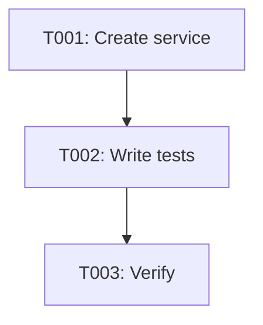

---
# Story dependencies (OPTIONAL here - primary source is spec.md)
# The orchestrator reads depends_on from spec.md first, then falls back here
# Only include here if you need to override or add dependencies discovered during planning
depends_on: []  # No dependencies for this story
blocks: [S004]  # S004-greeting-endpoint depends on this greeting service
---

# Tasks: S003 - Implement Greeting Service

**Input**: Design documents from story directory
**Prerequisites**: spec.md (✅), plan.md (✅), data-model.md (✅), contracts/ (✅)

## Execution Flow (main)
```
1. ✅ Load spec.md and plan.md from feature directory
2. ✅ Extract FR-XXX requirements, scenarios, NFRs
3. ✅ Load design documents (data-model.md, contracts/, quickstart.md)
4. ✅ Generate tasks by category (Setup, Tests, Core, Polish)
5. ✅ Apply task rules (parallel markers, TDD ordering)
6. ✅ Number tasks sequentially (T001, T002...)
7. ✅ Generate dependency graph
8. ✅ Validate task completeness
```

## Format: `[ID] [P?] Description`
- **[P]**: Can run in parallel (different files, no dependencies)
- Include exact file paths in descriptions

## Path Conventions
Single project structure (from plan.md):
- `src/services/` - Service implementations
- `tests/unit/` - Unit tests

---

## Implementation Context

### FR → Task Mapping

| FR ID | Requirement Summary | Implementing Tasks | Test Coverage |
|-------|---------------------|-------------------|---------------|
| FR-001 | Accept name parameter | T001 | tests/unit/greeting-service.test.ts |
| FR-002 | Return "Hello, {name}!" format | T001 | tests/unit/greeting-service.test.ts |
| FR-003 | Handle empty names with "Hello, stranger!" | T001 | tests/unit/greeting-service.test.ts |
| NFR-001 | Response time < 5ms | T001, T002 | tests/unit/greeting-service.test.ts |
| NFR-002 | Stateless service | T001 | tests/unit/greeting-service.test.ts |

**Coverage Check**: ✅ All FRs have implementing tasks and test coverage

### Research Decisions Reference

**Key technical decisions from plan.md**:

1. **Pure Function Pattern** (affects T001)
   - **Why**: Stateless requirement (NFR-002), simplicity, testability
   - **How**: Single function with no side effects
   ```typescript
   export function greet(name?: string): string {
     const trimmedName = name?.trim() || '';
     return trimmedName ? `Hello, ${trimmedName}!` : 'Hello, stranger!';
   }
   ```
   - **Performance**: <1ms execution (string operations only)

2. **Input Validation Strategy** (affects T001, T002)
   - **Why**: Clean code with TypeScript optional chaining
   - **How**: `name?.trim() || ''` handles all edge cases
   - **Security**: Input sanitization via trim()

### Codebase Patterns to Reuse

N/A - Greenfield implementation, no existing patterns to reuse

### Performance Targets

| Target | Technique | Tasks | Validation |
|--------|-----------|-------|------------|
| <5ms response | Pure function with minimal operations | T001 | T002 (performance test) |

### Security Requirements

| Requirement | Implementation | Tasks | Checklist |
|-------------|----------------|-------|-----------|
| Input sanitization | Trim whitespace | T001 | [x] No arbitrary code execution |
| No side effects | Pure function | T001 | [x] No global state |

### Design System Components

N/A - Backend service with no UI components

### Brand Voice Examples

**Copy used in this feature**:
- "Hello, stranger!" (friendly, welcoming tone for unknown users)
- "Hello, {name}!" (warm, personal greeting)

---

## Tasks

### Phase 1: Setup & Project Structure

- [ ] T001 [P] Create greeting service module with pure function implementation

**Implements**: FR-001 (accept name), FR-002 (format greeting), FR-003 (handle empty), NFR-002 (stateless)

**Pattern**: Pure function pattern from plan.md
```typescript
// File: src/services/greeting-service.ts
export function greet(name?: string): string {
  const trimmedName = name?.trim() || '';
  return trimmedName ? `Hello, ${trimmedName}!` : 'Hello, stranger!';
}
```

**Requirements**:
- Accept optional string parameter
- Trim whitespace from input
- Return "Hello, {name}!" for valid names
- Return "Hello, stranger!" for empty/undefined/whitespace names
- No side effects (pure function)
- TypeScript typing matches contract in contracts/greeting-service.ts

**File**: `src/services/greeting-service.ts` (create)
**Lines**: ~15 lines
**Validation**: Function signature matches contract, handles all edge cases

---

### Phase 2: Testing

- [ ] T002 [P] Write comprehensive unit tests for greeting service

**Implements**: All FRs (test coverage), NFR-001 (performance validation)

**Test Scenarios** (from quickstart.md):
1. Valid name → personalized greeting
2. Empty string → default greeting
3. Whitespace-only → default greeting
4. Undefined → default greeting
5. No arguments → default greeting
6. Performance check (<5ms execution)

**Pattern**: Jest testing with describe/it blocks
```typescript
// File: tests/unit/greeting-service.test.ts
import { greet } from '../../src/services/greeting-service';

describe('greet', () => {
  it('greets with valid name', () => {
    expect(greet('Alice')).toBe('Hello, Alice!');
  });
  
  it('greets with empty name', () => {
    expect(greet('')).toBe('Hello, stranger!');
  });
  
  it('greets with whitespace-only name', () => {
    expect(greet('   ')).toBe('Hello, stranger!');
  });
  
  it('greets with undefined', () => {
    expect(greet(undefined)).toBe('Hello, stranger!');
  });
  
  it('greets with no arguments', () => {
    expect(greet()).toBe('Hello, stranger!');
  });
  
  it('executes within performance target', () => {
    const start = performance.now();
    greet('Performance Test');
    const duration = performance.now() - start;
    expect(duration).toBeLessThan(5);
  });
});
```

**Requirements**:
- 100% code coverage (single function, fully testable)
- All scenarios from quickstart.md pass
- Performance test validates NFR-001 (<5ms)
- Tests follow existing Jest patterns

**File**: `tests/unit/greeting-service.test.ts` (create)
**Lines**: ~40 lines
**Validation**: All tests pass, coverage 100%

---

### Phase 3: Verification

- [ ] T003 Run tests and verify all requirements met

**Verifies**: All FRs and NFRs

**Actions**:
1. Run `npm test` to execute all tests
2. Verify all tests pass
3. Check code coverage report (should be 100%)
4. Validate TypeScript compilation (no errors)
5. Run linter (if configured)

**Success Criteria**:
- ✅ All 6 test scenarios pass
- ✅ Code coverage 100%
- ✅ TypeScript compiles without errors
- ✅ No linting errors
- ✅ Performance consistently <5ms

**Validation**: Matches acceptance criteria from spec.md

---

## Parallel Execution Strategy

**Phase 1 (Setup)**: 
```
T001 (create service) [P]
```
Single task, no parallelization needed.

**Phase 2 (Testing)**:
```
T002 (tests) [P] - Can run immediately after T001
```
Depends on T001, but marked [P] for clarity (independent file).

**Phase 3 (Verification)**:
```
T003 (run tests) - Sequential, validates all previous work
```

**Total Estimated Time**: ~30 minutes
- T001: 10 minutes (simple function)
- T002: 15 minutes (6 test scenarios)
- T003: 5 minutes (verification)

---

## Task Dependencies



**Critical Path**: T001 → T002 → T003

---

## Validation Checklist

**Before marking complete**:
- [x] All FRs mapped to tasks
- [x] All tasks have clear acceptance criteria
- [x] Test tasks exist for all requirements
- [x] Parallel execution opportunities marked [P]
- [x] File paths specified in task descriptions
- [x] Task descriptions include code examples
- [x] Performance targets included
- [x] Security requirements addressed

**Completeness Check**:
- [x] All contracts have test tasks (FR-001, FR-002, FR-003)
- [x] All entities have implementation tasks (none needed - stateless)
- [x] All scenarios from quickstart.md covered in T002
- [x] Performance targets from NFR-001 tested in T002
- [x] Constitution requirements addressed (stateless, pure function)

---

## Implementation Notes

**Simplicity Score**: ✅ PASS
- Single file implementation (~15 lines)
- No external dependencies
- Pure function (no state)
- No abstraction layers

**Constitution Compliance**:
- ✅ Stateless (NFR-002): Pure function with no side effects
- ✅ Performance (NFR-001): <5ms validated in tests
- ✅ Testability: 100% coverage achievable
- ✅ Simplicity: Minimal implementation (<100 lines total)

**Ready for Implementation**: Yes
- All design artifacts complete
- Tasks are concrete and executable
- Dependencies clear
- Success criteria defined
